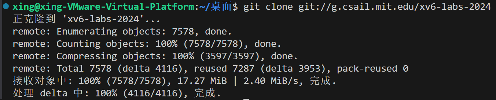
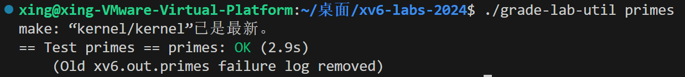

# Lab1: Xv6 and Unix utilities

- 2351289周慧星

---
## 目录

- [Lab1: Xv6 and Unix utilities](#lab1-xv6-and-unix-utilities)
  - [目录](#目录)
  - [实验跑分](#实验跑分)
  - [实验目的](#实验目的)
  - [启动 xv6](#启动-xv6)
    - [构建并运行xv6：](#构建并运行xv6)
  - [实验1：sleep(easy)](#实验1sleepeasy)
    - [一、实验目的](#一实验目的)
    - [二、实验内容](#二实验内容)
    - [三、实验结果](#三实验结果)
    - [四、遇到的问题和解决方案](#四遇到的问题和解决方案)
    - [五、实验心得](#五实验心得)
    - [六、核心代码](#六核心代码)
  - [实验2：pingpong(easy)](#实验2pingpongeasy)
    - [一、实验目的](#一实验目的-1)
    - [二、实验内容](#二实验内容-1)
    - [三、实验结果](#三实验结果-1)
    - [四、遇到的问题和解决方案](#四遇到的问题和解决方案-1)
    - [五、心得](#五心得)
    - [六、核心代码](#六核心代码-1)
  - [实验3：primes(moderate)](#实验3primesmoderate)
    - [一、实验目的](#一实验目的-2)
    - [二、实验内容](#二实验内容-2)
    - [三、实验结果](#三实验结果-2)
    - [四、遇到的问题和解决方案](#四遇到的问题和解决方案-2)
    - [五、心得](#五心得-1)
    - [六、核心代码](#六核心代码-2)
  - [实验4：find(moderate)](#实验4findmoderate)
    - [一、实验目的](#一实验目的-3)
    - [二、实验内容](#二实验内容-3)
    - [三、实验结果](#三实验结果-3)
    - [四、遇到的问题和解决方案](#四遇到的问题和解决方案-3)
    - [五、心得](#五心得-2)
    - [六、核心代码](#六核心代码-3)
  - [实验5：xargs(moderate)](#实验5xargsmoderate)
    - [一、实验目的](#一实验目的-4)
    - [二、实验内容](#二实验内容-4)
    - [三、实验结果](#三实验结果-4)
    - [四、遇到的问题和解决方案](#四遇到的问题和解决方案-4)
    - [五、心得](#五心得-3)
    - [六、核心代码](#六核心代码-4)


---

## 实验跑分

- 最终在util分支下跑分：
```bash
make grade
```

- 得分：


---

## 实验目的

本实验将使您熟悉 xv6 及其系统调用。

---

## 启动 xv6

1. 获取实验室的 xv6 源的 git 存储库:

```bash
   git clone git://g.csail.mit.edu/xv6-labs-2024
```  


```bash
   cd xv6-labs-2024
``` 

此实验室和后续实验室所需的文件使用 Git 版本控制系统进行分发。对于每个实验，您将查看为该实验量身定制的 xv6 版本。要了解有关 Git 的更多信息，请查看 Gituser 的手册，或者这个面向 CS 的 Git.Git 概述允许您跟踪对代码所做的更改。例如，如果你完成了其中一个练习，并且想要对进度进行检查点作，你可以通过运行以下命令来提交更改：

```bash
$ git commit -am 'my solution for util lab exercise 1'
Created commit 60d2135: my solution for util lab exercise 1
 1 files changed, 1 insertions(+), 0 deletions(-)
$

git diffgit diff origin/utilutilorigin/util
```
您可以使用 查看更改，它显示自上次提交以来的更改。 显示相对于初始代码的更改。 是此实验室的 git 分支的名称。

### 构建并运行xv6：

1. 在 xv6 源代码目录中，运行以下命令来编译 xv6：

```bash
   $ make qemu
```


如果在prompt处键入ls，您应该会看到类似于以下内容的输出：


这些是mkfs包含在初始文件系统中的文件，大多数是我们可以运行的程序，键入ls便是运行了其中一个。


---


## 实验1：sleep(easy)

### 一、实验目的

在 xv6 操作系统环境下，按照 UNIX `sleep` 命令的逻辑，实现一个用户级的 sleep 程序。通过该程序，使系统能够根据用户指定的 tick 数进行暂停，从而加深对 xv6 系统中进程调度、系统调用机制以及 C 语言在操作系统编程中应用的理解。同时，掌握在 xv6 系统中编写、编译和测试用户程序的流程与方法。

### 二、实验内容

- **代码编写**：在 `user/sleep.c` 文件中编写 sleep 程序代码。参考 `user` 目录下其他程序（如 `echo.c`、`grep.c`、`rm.c`）获取命令行参数的方式，接收用户输入的表示暂停 tick 数的字符串参数，并使用 `atoi` 函数将其转换为整数。调用系统调用 `sleep`，使程序按照用户指定的 tick 数进行暂停。在程序执行完毕后，调用 `exit(0)` 正常退出。
- **程序集成**：将编写好的 sleep 程序添加到 Makefile 中的 `UPROGS` 变量中，以便在执行 `make qemu` 命令时，能够将 sleep 程序编译并添加到 xv6 系统中，使其可以在 xv6 shell 中运行。
- **错误处理**：对用户输入进行检查，如果用户忘记传递参数，sleep 程序应打印相应的错误信息，提示用户正确使用该程序。
- **程序测试**：通过在 xv6 shell 中运行 sleep 程序（如 `sleep 10`），观察程序是否能够按照指定的 tick 数暂停。使用 `make grade` 或 `./grade-lab-util sleep`、`make GRADEFLAGS=sleep grade` 等命令运行测试，验证程序是否通过所有与 sleep 相关的测试用例。

### 三、实验结果

- 测试：


- 得分：
  


### 四、遇到的问题和解决方案

- **获取命令行参数**：起初不清楚如何正确获取命令行参数。通过查看 `user` 目录下其他程序（如 `echo.c`），了解到可以通过 `main` 函数的参数 `argc` 和 `argv` 获取命令行参数。
- **字符串转整数**：将字符串参数转换为整数时遇到问题。查阅资料后，发现可以使用 `atoi` 函数，并在 `user/ulib.c` 中有实现，包含相应头文件后即可使用。
- **Makefile 集成错误**：添加到 Makefile 的 `UPROGS` 后编译报错。检查 Makefile 中 `UPROGS` 变量的格式，确保路径和格式正确，最终解决编译错误。
- **程序未暂停**：运行 sleep 程序后没有暂停。通过查看 `kernel/sysproc.c` 中 sleep 系统调用的实现，分析参数传递过程，发现参数传递错误，修正后程序正常暂停。

### 五、实验心得

通过本次实验，对 xv6 操作系统的结构和工作原理有了更深入的理解。在实现用户级 sleep 程序的过程中，巩固了 C 语言编程知识，掌握了在操作系统环境下编写用户程序的方法和技巧。对系统调用的流程有了清晰认识，从用户程序调用系统调用，到通过汇编代码进入内核执行相应的系统调用函数，整个过程环环相扣。遇到问题时，通过查阅文档、参考代码和调试，逐步解决问题，提升了问题解决能力和独立思考能力。

### 六、核心代码

```c
    if (argc < 2) {
        fprintf(2, "请输入参数sleep ticks!\n");
        exit(1);
    }
    int ticks = atoi(argv[1]);
    sleep(ticks);
    exit(0);
```


---

## 实验2：pingpong(easy)

### 一、实验目的
在xv6操作系统环境下，实现一个用户级的pingpong程序，通过一对管道（父子进程各使用一个方向的管道）实现两个进程间的字节交换，加深对进程间通信（IPC）机制、管道操作以及进程创建与同步的理解，掌握在xv6系统中使用pipe、fork、write、read和getpid等系统调用编写多进程程序的方法。

### 二、实验内容
1. **代码编写**：在`user/pingpong.c`文件中编写pingpong程序代码。创建两个管道，一个用于父进程向子进程发送数据（ping），另一个用于子进程向父进程发送数据（pong）。使用`fork()`创建子进程，在父子进程中分别关闭不需要的管道端，然后进行数据的发送、接收和输出。
2. **程序集成**：将编写好的pingpong程序添加到`Makefile`中的`UPROGS`变量中，以便在执行`make qemu`命令时，能够将pingpong程序编译并添加到xv6系统中，使其可以在xv6 shell中运行。
3. **程序测试**：通过在xv6 shell中运行`pingpong`程序，观察程序是否能够正确实现父子进程间的字节交换，并按照指定格式输出信息（子进程先输出“<子进程PID>: received ping”，父进程后输出“<父进程PID>: received pong”）。使用`make grade`命令运行测试，验证程序是否通过所有与pingpong相关的测试用例。


### 三、实验结果

- 测试：


- 得分：
  


### 四、遇到的问题和解决方案
1. **问题**：不清楚如何正确使用管道进行双向通信。
   **解决方案**：查阅xv6文档和相关资料，了解到需要创建两个管道，每个管道负责一个方向的通信。父进程向子进程发送数据使用一个管道（父写子读），子进程向父进程发送数据使用另一个管道（子写父读）。
2. **问题**：管道读写操作出现阻塞或错误。
   **解决方案**：分析代码发现，在父子进程中没有正确关闭不需要的管道端。例如，父进程在向子进程发送数据的管道中不需要读端，子进程在该管道中不需要写端；同理，在子进程向父进程发送数据的管道中，父子进程也需要关闭相应的不需要的端。关闭不需要的管道端后，程序能够正常进行读写操作。
3. **问题**：输出顺序不符合要求，父进程先于子进程输出。
   **解决方案**：检查代码发现，父进程在读取子进程发送的数据时没有进行适当的同步。通过确保父进程在子进程发送数据后再进行读取，保证了输出顺序的正确性。
4. **问题**：添加到`Makefile`后编译出现错误。
   **解决方案**：仔细检查`Makefile`中`UPROGS`变量的格式，确保添加的pingpong程序路径和格式与其他程序一致，最终解决了编译错误。

### 五、心得
通过本次实验，我对操作系统中进程间通信的机制有了更深入的理解。特别是管道作为一种简单而有效的通信方式，在实际应用中需要注意正确的使用方法，包括创建多个管道实现双向通信、合理关闭不需要的管道端以避免资源浪费和死锁等问题。

在编写多进程程序时，进程间的同步和协调非常重要，一个小的疏忽可能导致程序执行顺序混乱或出现错误。

此外，本次实验也让我更加熟悉了xv6操作系统的开发环境和工具链，学会了如何在xv6中添加和测试新的用户程序。

### 六、核心代码
```c
    if (pid == 0) {  //此时是子进程
        close(parent_to_child[1]);  // 关闭写端
        close(child_to_parent[0]);  // 关闭读端

        // 读取父进程发送的数据
        read(parent_to_child[0], &buffer, 1);
        printf("%d: received ping\n", getpid());

        // 向父进程发送数据
        write(child_to_parent[1], &buffer, 1);
        close(parent_to_child[0]);
        close(child_to_parent[1]);
        exit(0);
    } 
    else {// 父进程
        close(parent_to_child[0]);  // 关闭读端
        close(child_to_parent[1]);  // 关闭写端
        write(parent_to_child[1], &buffer, 1);
        read(child_to_parent[0], &buffer, 1);
        printf("%d: received pong\n", getpid());
        close(parent_to_child[1]);
        close(child_to_parent[0]);
        exit(0);
    }
```

---

## 实验3：primes(moderate)
### 一、实验目的
在xv6操作系统环境下，实现一个基于管道的并发素数筛程序，通过创建多个进程形成管道流水线，每个进程负责筛选出特定素数的倍数，从而生成从2到280之间的所有素数。通过该实验，深入理解管道通信机制、进程创建与同步、并发编程思想以及递归算法在操作系统中的应用，掌握在xv6系统中实现复杂多进程程序的方法。

### 二、实验内容
1. **代码编写**：在`user/primes.c`文件中编写并发素数筛程序代码。主函数创建第一个管道并向其中写入2到280的整数，然后调用递归函数`primes`创建后续的筛选进程。`primes`函数从管道读取数据，将第一个数作为素数输出，并创建新的管道和子进程，继续筛选剩余的数。每个进程负责处理一个素数的筛选工作，形成一个递归的管道流水线。
2. **资源管理**：在每个进程中，仔细关闭不需要的文件描述符，防止资源泄漏。主进程在写入所有数据后，关闭写端并等待所有子进程结束。
3. **程序集成**：将编写好的primes程序添加到`Makefile`中的`UPROGS`变量中，以便在执行`make qemu`命令时，能够将primes程序编译并添加到xv6系统中，使其可以在xv6 shell中运行。
4. **程序测试**：通过在xv6 shell中运行`primes`程序，观察程序是否能够正确输出2到280之间的所有素数。使用`make grade`命令运行测试，验证程序是否通过所有与primes相关的测试用例。
   


### 三、实验结果

- 测试：


- 得分：




### 四、遇到的问题和解决方案
1. **问题**：进程无法正确终止，导致输出不完整或程序卡死。
   **解决方案**：分析发现是由于文件描述符未正确关闭，导致子进程无法检测到管道写端关闭，从而无法正常终止。通过在每个进程中仔细关闭不需要的文件描述符，确保子进程能够在读取完所有数据后正确终止。
2. **问题**：递归创建进程时出现栈溢出或无限递归错误。
   **解决方案**：在函数声明中添加`__attribute__((noreturn))`属性，明确告知编译器该函数不会返回，避免递归调用时的栈空间问题。同时，确保递归终止条件正确，避免无限递归。
3. **问题**：输出顺序混乱，素数未按正确顺序输出。
   **解决方案**：检查代码发现是由于父子进程并发执行导致输出混乱。通过确保每个进程在输出前等待其父进程完成输出，保证了素数按从小到大的顺序输出。
4. **问题**：添加到`Makefile`后编译出现错误。
   **解决方案**：仔细检查`Makefile`中`UPROGS`变量的格式，确保添加的primes程序路径和格式与其他程序一致，最终解决了编译错误。

### 五、心得
通过本次实验，我对操作系统中的并发编程和管道通信机制有了更深入的理解。并发素数筛的实现不仅考验了对管道操作和进程创建的掌握，还需要巧妙地设计递归算法和合理管理系统资源。

在实现过程中，我深刻体会到资源管理的重要性，一个小小的文件描述符未关闭可能导致整个程序无法正常运行。同时，递归算法的设计需要考虑终止条件和栈空间的使用，合理的函数声明和调用方式能够避免许多潜在的问题。

此外，本次实验也让我认识到调试多进程程序的难度，通过打印关键信息和逐步分析，最终找到并解决问题的过程，极大地提升了我的问题解决能力和对操作系统底层机制的理解。

### 六、核心代码
```c
void primes(int fd) {
    int prime;
    if (read(fd, &prime, sizeof(int)) == 0) { //没有数据了
        close(fd);
        exit(0);
    }
    printf("prime %d\n", prime);

    int p[2];
    pipe(p);
    int pid = fork();
    if (pid < 0) {
        fprintf(2, "创建进程失败！\n");
        exit(1);
    }
    if (pid == 0) {
        close(p[1]);  
        close(fd);  
        primes(p[0]);
    } else {
        close(p[0]);  
        int i;
        while (read(fd, &i, sizeof(int)) > 0) {
            if (i % prime != 0) {
                write(p[1], &i, sizeof(int));
            }
        }
        close(fd);    // 关闭当前读端
        close(p[1]);  // 关闭写端
        wait(0);      // 等待子进程结束
        exit(0);
    }
}
```

---


## 实验4：find(moderate)
### 一、实验目的
在xv6操作系统环境下，实现一个简单版本的UNIX find程序，用于在指定目录树中查找具有特定名称的文件。通过该实验，深入理解文件系统操作、目录遍历、递归算法以及字符串处理在操作系统中的应用，掌握在xv6系统中实现文件查找功能的方法。

### 二、实验内容
1. **代码编写**：在`user/find.c`文件中编写find程序代码。参考`user/ls.c`的实现方式，使用系统调用读取目录内容。实现递归函数遍历目录树，对每个目录项进行检查，若为目录且不是"."或".."，则递归进入该子目录继续查找；若为文件且名称与目标名称匹配，则输出该文件的完整路径。
2. **路径处理**：构建完整的文件路径，确保正确处理当前目录和子目录的关系，避免路径拼接错误。
3. **程序集成**：将编写好的find程序添加到`Makefile`中的`UPROGS`变量中，以便在执行`make qemu`命令时，能够将find程序编译并添加到xv6系统中，使其可以在xv6 shell中运行。
4. **程序测试**：通过在xv6 shell中运行`find`命令，创建测试文件和目录结构，验证程序是否能够正确查找并输出所有匹配的文件路径。使用`make grade`命令运行测试，验证程序是否通过所有与find相关的测试用例。


### 三、实验结果

- 测试：


- 得分：


### 四、遇到的问题和解决方案
1. **问题**：无法正确读取目录内容。
   **解决方案**：参考`user/ls.c`的实现，使用`opendir`打开目录，`readdir`读取目录项，`closedir`关闭目录。确保正确处理目录项的类型和名称。
2. **问题**：递归遍历目录时出现无限循环。
   **解决方案**：检查发现没有正确过滤掉"."和".."目录，导致程序不断在当前目录和父目录之间循环。添加判断条件，避免递归进入这两个特殊目录。
3. **问题**：路径拼接错误，输出的文件路径格式不正确。
   **解决方案**：仔细处理路径拼接逻辑，确保在目录名和文件名之间正确添加路径分隔符"/"，同时处理好根目录的特殊情况。
4. **问题**：添加到`Makefile`后编译出现错误。
   **解决方案**：仔细检查`Makefile`中`UPROGS`变量的格式，确保添加的find程序路径和格式与其他程序一致，最终解决了编译错误。

### 五、心得
通过本次实验，我对操作系统中的文件系统操作和目录遍历机制有了更深入的理解。实现find程序不仅需要掌握基本的文件操作函数，还需要合理设计递归算法和处理复杂的路径拼接问题。

在实现过程中，我深刻体会到字符串处理在C语言中的重要性和复杂性，正确使用字符串处理函数（如`strcmp`、`strcpy`、`strcat`）是确保程序正确性的关键。同时，递归算法的设计需要清晰的逻辑和边界条件处理，避免出现无限递归或遗漏某些情况。

此外，本次实验也让我更加熟悉了xv6系统的文件系统结构和开发环境，学会了如何利用已有的代码示例（如`ls.c`）来实现新的功能，这对我后续深入学习操作系统原理和进行相关开发工作具有重要的意义。

### 六、核心代码
```c
void find(char *path, char *target) {   //在目录path下查找文件target
    char buf[512], *p;
    int fd;
    struct dirent de;
    struct stat st;

    if ((fd = open(path, 0)) < 0) {
        fprintf(2, "find: 无法打开！ %s\n", path);
        return;
    }
    if (fstat(fd, &st) < 0) {
        fprintf(2, "find: cannot stat %s\n", path);
        close(fd);
        return;
    }
    if (strlen(path) + 1 + DIRSIZ + 1 > sizeof buf) {
        fprintf(2, "find: 路径太长！\n");
        close(fd);
        return;
    }
    strcpy(buf, path);
    p = buf + strlen(buf);
    *p++ = '/';

    while (read(fd, &de, sizeof(de)) == sizeof(de)) {
        if (de.inum == 0)
            continue;
        // 跳过 "." 和 ".."
        if (!strcmp(de.name, ".") || !strcmp(de.name, ".."))
            continue;
        memmove(p, de.name, DIRSIZ);
        p[DIRSIZ] = 0;
        if (stat(buf, &st) < 0) {
            printf("find: cannot stat %s\n", buf);
            continue;
        }
        switch (st.type) {
            case T_FILE:
                if (!strcmp(de.name, target)) {
                    printf("%s\n", buf);
                }
                break;
            case T_DIR:
                find(buf, target);
                break;
        }
    }
    close(fd);
}
```

---

## 实验5：xargs(moderate)

### 一、实验目的
在xv6操作系统环境下，实现一个简单版本的UNIX xargs程序，用于从标准输入读取行数据，并为每一行数据执行指定的命令，将读取的行作为参数追加到命令后。通过该实验，深入理解进程创建、命令执行、输入处理以及进程间通信机制，掌握在xv6系统中实现命令行工具的方法。

### 二、实验内容
1. **代码编写**：在`user/xargs.c`文件中编写xargs程序代码。从标准输入读取数据，逐行处理，每行数据作为额外参数追加到命令后。使用`fork()`创建子进程，在子进程中使用`exec()`执行命令，父进程使用`wait()`等待子进程完成。
2. **参数处理**：解析命令行参数，分离出基础命令及其参数，为后续处理每行输入数据做准备。
3. **输入处理**：逐字符读取标准输入，识别换行符以分割不同行的数据，并处理行末可能的空字符或特殊字符。
4. **程序集成**：将编写好的xargs程序添加到`Makefile`中的`UPROGS`变量中，以便在执行`make qemu`命令时，能够将xargs程序编译并添加到xv6系统中，使其可以在xv6 shell中运行。
5. **程序测试**：通过在xv6 shell中运行`xargs`命令，结合`echo`、`find`、`grep`等命令进行测试，验证程序是否能够正确处理输入并执行相应命令。使用`sh < xargstest.sh`运行测试脚本，验证程序是否通过所有与xargs相关的测试用例。

### 三、实验结果
- 测试：


- 得分：


### 四、遇到的问题和解决方案
1. **问题**：无法正确读取标准输入的所有行。
   **解决方案**：实现逐字符读取的逻辑，确保读取到换行符时正确处理当前行，并处理行末可能的特殊字符。添加循环读取直到文件结束，确保不会遗漏任何输入行。
2. **问题**：子进程执行命令失败。
   **解决方案**：检查`exec()`调用的参数，确保参数数组正确构造，包含命令名和所有参数，且以`NULL`结尾。调试发现参数传递错误，修正后子进程能够正确执行命令。
3. **问题**：父进程未正确等待子进程结束。
   **解决方案**：在父进程中添加`wait()`调用，确保每个子进程执行完毕后父进程才继续处理下一行输入，避免出现僵尸进程和输出混乱。
4. **问题**：添加到`Makefile`后编译出现错误。
   **解决方案**：仔细检查`Makefile`中`UPROGS`变量的格式，确保添加的xargs程序路径和格式与其他程序一致，最终解决了编译错误。

### 五、心得
通过本次实验，我对操作系统中进程创建和命令执行机制有了更深入的理解。实现xargs程序需要巧妙地处理输入数据、构造参数数组，并正确管理父子进程的执行流程。

在实现过程中，我深刻体会到C语言中字符串处理和内存管理的重要性，正确处理换行符、空字符以及参数数组的构造是确保程序正确性的关键。同时，进程间的同步和协调也非常重要，合理使用`wait()`可以避免僵尸进程的产生。

此外，本次实验也让我更加熟悉了xv6系统的开发环境和工具链，学会了如何利用系统调用实现复杂的命令行工具。通过与之前实现的`find`和`grep`程序结合使用，我进一步理解了UNIX哲学中"小而专"的工具如何通过管道组合实现强大功能。

### 六、核心代码
```c
// 从标准输入读取行
    while (read(0, &c, 1) > 0) {
        if (c == '\n' || len >= MAXLINE - 1) {
            line[len] = '\0';         // 终止字符串
            char *full_argv[MAXARG];  // 为当前行创建完整的参数数组
            for (int i = 0; i < base_argc; i++) {
                full_argv[i] = base_argv[i];
            }
            full_argv[base_argc] = line;      // 添加当前行作为额外参数
            full_argv[base_argc + 1] = NULL;  // 参数数组必须以NULL结尾
            int pid = fork();         // 创建子进程执行命令
            if (pid < 0) {
                fprintf(2, "进程创建失败！\n");
                exit(1);
            } else if (pid == 0) {
                exec(base_argv[0], full_argv);
                // 如果exec返回，说明执行失败
                fprintf(2, "exec执行命令失败！ %s\n", base_argv[0]);
                exit(1);
            } else {
                wait(0);
            }
            len = 0;  // 重置行长度
        } else {
            line[len++] = c;
        }
    }
```
