# Lab2: System Calls 

- 2351289周慧星
---

## 目录

- [Lab2: System Calls](#lab2-system-calls)
  - [目录](#目录)
  - [实验跑分](#实验跑分)
  - [实验准备](#实验准备)
    - [1. 切换到 `syscall` 分支：](#1-切换到-syscall-分支)
    - [2. 验证初始状态：](#2-验证初始状态)
  - [实验1：Using gdb (easy)](#实验1using-gdb-easy)
    - [一、实验目的](#一实验目的)
    - [二、实验内容](#二实验内容)
      - [1、正确启动 GDB 并加载内核符号](#1正确启动-gdb-并加载内核符号)
      - [2、设置断点并调试](#2设置断点并调试)
    - [三、实验结果](#三实验结果)
    - [四、遇到的问题和解决方案](#四遇到的问题和解决方案)
    - [五、实验心得](#五实验心得)
    - [六、问题回答](#六问题回答)
  - [实验2：System call tracing (moderate)](#实验2system-call-tracing-moderate)
    - [一、实验目的](#一实验目的-1)
    - [二、实验步骤](#二实验步骤)
      - [1. 修改 Makefile 添加用户程序](#1-修改-makefile-添加用户程序)
      - [2. 添加系统调用接口](#2-添加系统调用接口)
      - [3. 实现内核中的 `sys_trace()`](#3-实现内核中的-sys_trace)
      - [4. 修改进程结构体和 `fork()`](#4-修改进程结构体和-fork)
      - [5. 修改 `syscall()` 打印跟踪信息](#5-修改-syscall-打印跟踪信息)
    - [三、测试与验证](#三测试与验证)
    - [四、遇到的问题和解决方案](#四遇到的问题和解决方案-1)
    - [五、实验心得](#五实验心得-1)
  - [实验3：Attack xv6 (moderate)](#实验3attack-xv6-moderate)
    - [一、实验目标](#一实验目标)
    - [二、漏洞bug原理](#二漏洞bug原理)
    - [三、攻击思路](#三攻击思路)
    - [四、攻击核心代码实现](#四攻击核心代码实现)
    - [五、测试与验证](#五测试与验证)
    - [六、遇到的问题与解决方案](#六遇到的问题与解决方案)
    - [七、实验心得](#七实验心得)

---

## 实验跑分

- 最终在syscall分支下跑分：
```bash
make grade
```

- 得分：

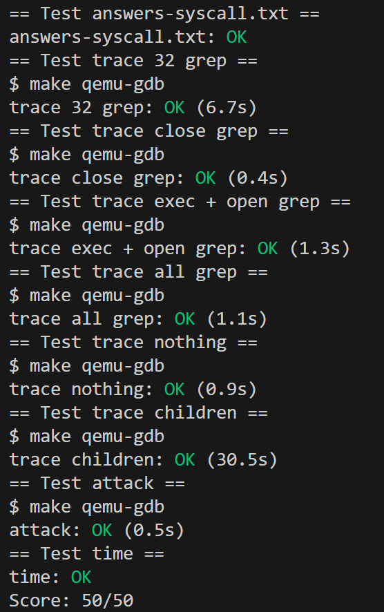

---

## 实验准备
本实验需要为 xv6 添加新的系统调用，理解系统调用的工作原理，重点实现 `trace` 功能，使 `make grade` 测试通过。

- 阅读 xv6 书籍第 2 章，以及第 4 章的 4.3 和 4.4 节。
- 核心文件解析：
  - **用户态系统调用桩代码**：`user/usys.S`（由 `user/usys.pl` 生成）、`user/user.h`（系统调用声明）。
  - **内核态系统调用路由**：`kernel/syscall.c`（系统调用分发逻辑）、`kernel/syscall.h`（系统调用编号）。
  - **进程相关代码**：`kernel/proc.h`（进程结构体定义）、`kernel/proc.c`（进程管理）。


### 1. 切换到 `syscall` 分支：
   ```bash
   git fetch
   git checkout syscall
   make clean
   ```

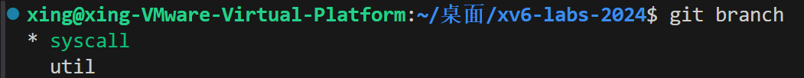

### 2. 验证初始状态：
   ```bash
   make grade
   ```
   - 此时会显示 `trace` 执行失败，`attacktest` 失败，这是正常的，需要通过添加系统调用来修复。

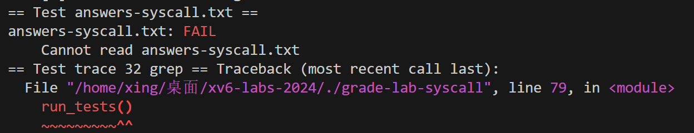


---

## 实验1：Using gdb (easy)

### 一、实验目的
通过使用 GDB 调试器对 xv6 内核进行调试，熟悉 GDB 的基本操作（如设置断点、单步执行、查看栈回溯等），理解 xv6 系统调用的执行流程、CPU 模式切换机制以及内核异常处理逻辑。同时，掌握通过调试工具分析内核崩溃原因的方法，加深对操作系统内核工作原理的理解。


### 二、实验内容
1. **GDB 基本操作练习**：启动 `make qemu-gdb` 并在另一个窗口打开 GDB，设置 `syscall` 断点，使用 `c`（继续执行）、`layout src`（查看源码）、`backtrace`（查看栈回溯）等命令。

#### 1、正确启动 GDB 并加载内核符号
1. **第一步：启动带 GDB 调试的 qemu**  
   在第一个终端执行（保持运行，不要关闭）：
```bash
   make qemu-gdb
```
   此时会显示类似输出，等待 GDB 连接：
```bash
   Listening for gdb on tcp port 26000
```

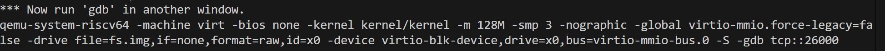

2. **第二步：在新终端启动 GDB 并加载内核**  
   打开第二个终端，进入 `xv6-labs-2024` 目录，执行：
```bash
   gdb-multiarch kernel/kernel  # 关键：加载内核符号表（kernel/kernel）
```

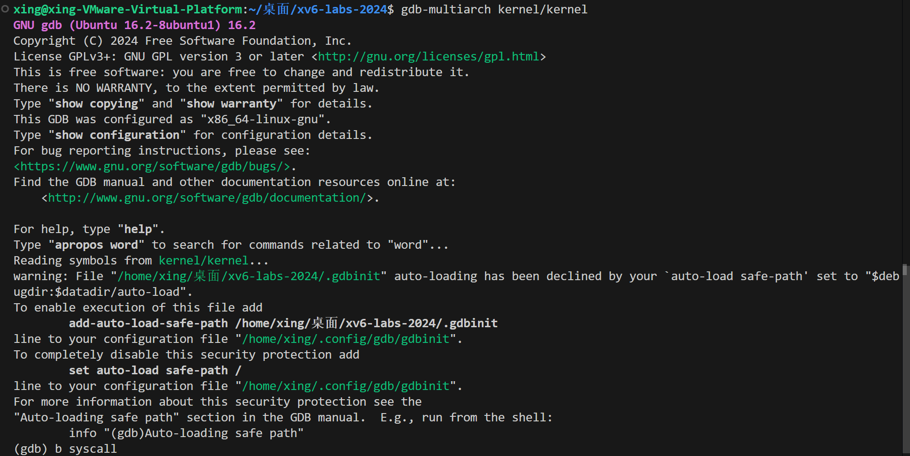

3. **第三步：连接到 qemu**  
   在 GDB 命令行中输入：
```bash
   (gdb) target remote localhost:26000
Remote debugging using localhost:26000
0x0000000000001000 in ?? ()
```
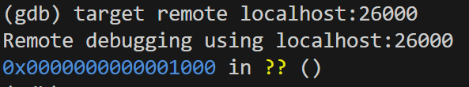

#### 2、设置断点并调试
完成连接后，即可正常设置断点：
```bash
(gdb) b syscall  # 设置 syscall 函数断点
(gdb) c  # 继续执行内核
```

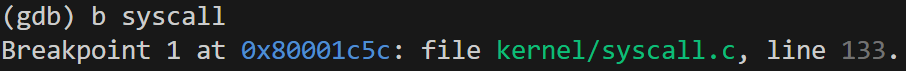
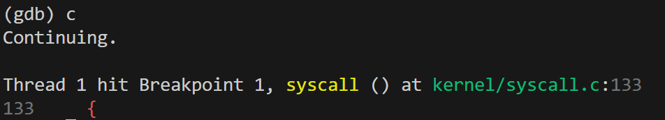


2. **栈回溯分析**：通过 `backtrace` 确定调用 `syscall` 的函数。
```bash
(gdb) layout src
(gdb) backtrace
```

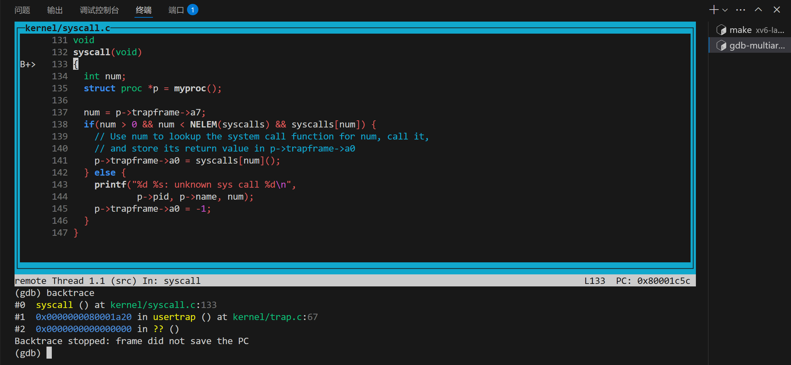

3. **进程结构体查看**：单步`n`执行过 `struct proc *p = myproc();` 后，使用 `p /x *p` 查看进程结构体，分析 `p->trapframe->a7` 的值及含义。
4. **CPU 模式查看**：通过 `p /x $sstatus` 查看特权寄存器，确定 CPU 之前的运行模式。
5. **内核崩溃调试**：修改 `syscall` 函数触发内核崩溃，通过 `sepc` 值在 `kernel/kernel.asm` 中定位崩溃指令，分析崩溃原因及相关进程信息。


### 三、实验结果
1. **栈回溯结果**：`backtrace` 显示 `syscall` 函数由 `usertrap()` 函数调用，栈帧信息如下：

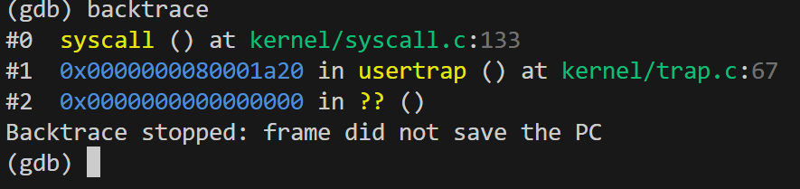

2. **p->trapframe->a7 分析**：执行 `p /x *p` 后，`p->trapframe->a7` 的值为 `0x1`，该值表示**系统调用号**，用于内核识别用户请求的具体系统调用。

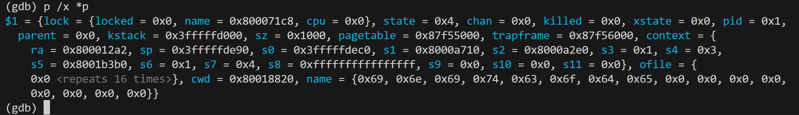

3. **CPU 模式查询**：`p /x $sstatus` 输出中(需转二进制)，`SPP` 位（第 8 位）为 `0`，表明 CPU 之前处于**用户模式（User mode）**。

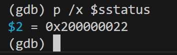

4. **内核崩溃调试结果**：
   
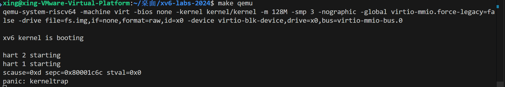

   - 崩溃时的汇编指令（通过 `sepc=0x80001c6c` 在 `kernel/kernel.asm` 中查询）：`lw a3, 0(zero)`。

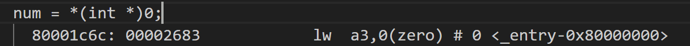

   - 触发崩溃的进程：名称为 `initcode`，PID 为 `1`。

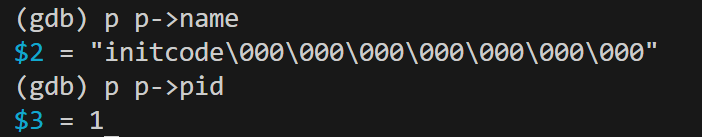


### 四、遇到的问题和解决方案
1. **GDB 无法连接 qemu**：
   - 问题：执行 `make qemu-gdb` 后，GDB 提示“Connection refused”。
   - 解决方案：检查是否同时启动了多个 `qemu` 实例，关闭所有实例后重新执行；确保 `kernel/Makefile` 中 `GDBPORT` 未被占用。

2. **栈回溯信息不完整**：
   - 问题：`backtrace` 只显示部分栈帧，无法看到 `usertrap()`。
   - 解决方案：确保内核编译时开启了调试信息（`Makefile` 中包含 `-g` 选项），重新执行 `make clean && make`。

3. **无法定位 sepc 对应的汇编指令**：
   - 问题：在 `kernel/kernel.asm` 中找不到 `sepc` 对应的地址。
   - 解决方案：确认 `kernel/kernel.asm` 是最新编译生成的，重新编译内核后再查询。


### 五、实验心得
通过本次实验，熟练掌握了 GDB 在 xv6 内核调试中的基本用法，学会了利用断点、栈回溯、寄存器查看等功能分析内核运行状态。深入理解了系统调用从用户态到内核态的切换过程：用户程序通过 `ecall` 指令陷入内核，`usertrap()` 捕获异常后调用 `syscall()` 处理具体请求。同时，认识到内核中无效地址访问（如访问 `0x0`）会导致页错误，而 `scause` 寄存器可用于定位异常类型，这为后续调试内核错误提供了重要方法。


### 六、问题回答
Looking at the backtrace output, which function called syscall?

1. **调用 syscall 的函数**：`usertrap()`。
   
What is the value of p->trapframe->a7 and what does that value represent? (Hint: look user/initcode.S, the first user program xv6 starts.)

2. **p->trapframe->a7**：值为系统调用号（如 `0x1`），代表用户请求的系统调用类型。

What was the previous mode that the CPU was in?

3. **之前的 CPU 模式**：用户模式（通过 `sstatus` 寄存器的 `SPP` 位判断）。

Write down the assembly instruction the kernel is panicing at. Which register corresponds to the variable num?

4. **崩溃时的汇编指令**：`lw a5, 0(zero)`，变量 `num` 对应 `a5` 寄存器。

Why does the kernel crash? Hint: look at figure 3-3 in the text; is address 0 mapped in the kernel address space? Is that confirmed by the value in scause above?

5. **内核崩溃原因**：地址 `0x0` 未在内核地址空间中映射，触发加载页错误（`scause=0xd`）。

What is the name of the process that was running when the kernel paniced? What is its process id (pid)?

6. **崩溃时的进程**：名称为 `initcode`，PID 为 `1`。


---

## 实验2：System call tracing (moderate)

### 一、实验目的
实现一个 `trace` 系统调用，通过掩码控制进程跟踪指定类型的系统调用，并在系统调用返回时打印相关信息（进程 ID、系统调用名称、返回值）。跟踪掩码需被子进程继承，不影响其他进程。

### 二、实验步骤
#### 1. 修改 Makefile 添加用户程序
在 `Makefile` 的 `UPROGS` 变量中添加 `$U/_trace`。

#### 2. 添加系统调用接口
**（1）在 `user/user.h` 中添加函数原型**

```c
int trace(int);  // 新增 trace 函数原型
```

**（2）在 `user/usys.pl` 中添加系统调用存根**

```c
entry("trace");  // 新增 trace 系统调用
```

**（3）在 `kernel/syscall.h` 中添加系统调用编号**

```c
#define SYS_trace 22  // 新增 trace 系统调用编号（确保不与现有编号冲突）
```

#### 3. 实现内核中的 `sys_trace()`
在 `kernel/sysproc.c` 中添加：
```c
uint64
sys_trace(void)
{
  int mask;
  argint(0, &mask);  // 获取第一个参数（掩码）
  myproc()->trace_mask = mask;  // 保存掩码到当前进程
  return 0;  // 返回成功
}
```

在 `kernel/syscall.c` 的 `syscalls` 数组中添加：
```c
extern uint64 sys_trace(void);  // 声明 sys_trace 函数

static uint64 (*syscalls[])(void) = {
  // ... 原有系统调用 ...
  [SYS_trace]   sys_trace,  // 新增 trace 系统调用
};
```

#### 4. 修改进程结构体和 `fork()`
**（1）在 `kernel/proc.h` 的 `struct proc` 中添加 `trace_mask`**

```c
struct proc {
  // ... 原有字段 ...
  int trace_mask;  // 新增跟踪掩码字段
};
```

**（2）在 `kernel/proc.c` 的 `fork()` 中复制掩码**

```c
int
fork(void)
{
  // ... 原有代码 ...
  np->trace_mask = p->trace_mask;
  // ... 原有代码 ...
}
```

#### 5. 修改 `syscall()` 打印跟踪信息
在 `kernel/syscall.c` 中：

**（1）在开头附近添加系统调用名称数组**
```c
static char *syscall_names[] = {
  [SYS_fork]    "fork",
  [SYS_exit]    "exit",
  [SYS_wait]    "wait",
  [SYS_pipe]    "pipe",
  [SYS_read]    "read",
  [SYS_kill]    "kill",
  [SYS_exec]    "exec",
  [SYS_fstat]   "fstat",
  [SYS_chdir]   "chdir",
  [SYS_dup]     "dup",
  [SYS_getpid]  "getpid",
  [SYS_sbrk]    "sbrk",
  [SYS_sleep]   "sleep",
  [SYS_uptime]  "uptime",
  [SYS_open]    "open",
  [SYS_write]   "write",
  [SYS_mknod]   "mknod",
  [SYS_unlink]  "unlink",
  [SYS_link]    "link",
  [SYS_mkdir]   "mkdir",
  [SYS_close]   "close",
  [SYS_trace]   "trace",  
};
```

**（2）修改 `syscall()` 函数**

```c
void
syscall(void)
{
  int num;
  struct proc *p = myproc();

  num = p->trapframe->a7;
  if(num > 0 && num < NELEM(syscalls) && syscalls[num]) {
    p->trapframe->a0 = syscalls[num]();
    
    // 新增：检查跟踪掩码并打印信息
    if(p->trace_mask & (1 << num)) {
      if(num < NELEM(syscall_names) && syscall_names[num]) {
        printf("%d: syscall %s -> %d\n", 
               p->pid, syscall_names[num], p->trapframe->a0);
      }
    }
  } else {
    printf("%d %s: unknown sys call %d\n",
            p->pid, p->name, num);
    p->trapframe->a0 = -1;
  }
}
```

### 三、测试与验证
编译并运行 xv6，执行以下测试：
```bash
$ trace 32 grep hello README  # 跟踪 read 系统调用
```

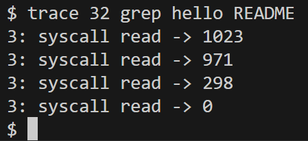

```bash
$ trace 2147483647 grep hello README  # 跟踪所有系统调用
```

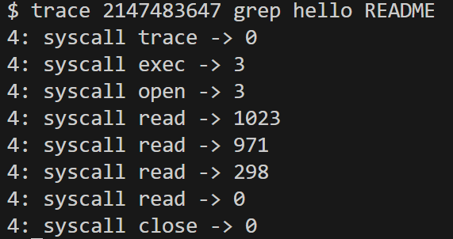

```bash
$ grep hello README  # 无跟踪，无输出
```

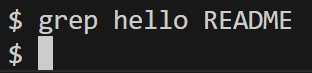

```bash
$ trace 2 usertests forkforkfork  # 跟踪 fork 系统调用
```

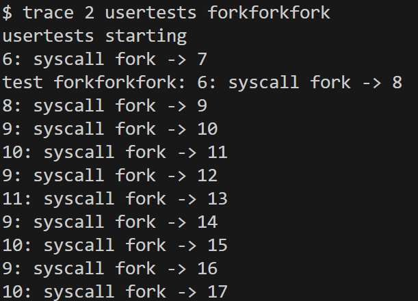

- 得分

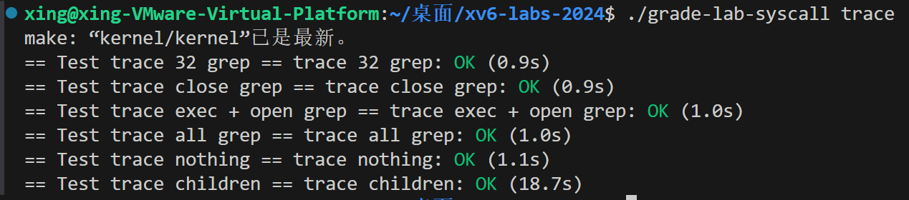


### 四、遇到的问题和解决方案

- **用户态和内核态之间的数据传递**：在系统调用的实现中，需要正确地传递参数和数据，包括用户态和内核态之间的切换。通过仔细阅读系统调用相关的文档和源代码，掌握了正确使用数据传递方法，如使用合适的系统调用参数读取函数等。

- **系统调用参数传递**：用户程序通过调用 sys_trace 系统调用来传递一个整数参数 mask 给内核，用于指定要追踪的系统调用。用户程序通过 argint 函数将参数从用户空间传递到内核空间。

- **内核态与用户态切换**：当用户程序调用 sys_trace 系统调用时，会触发用户态切换到内核态，这个切换由系统调用机制完成。

- **数据传递和复制**：用户程序传递给内核的 tracemask 参数需要在内核中进行数据复制，确保内核能够访问到正确的数据。

- **数据验证和权限检查**：内核需要验证用户传递的 tracemask 参数是否合法，并确保用户程序有权限调用 sys_trace 系统调用。

### 五、实验心得

通过本实验，学会了如何在 xv6 内核中添加新的系统调用，如何修改进程控制块以支持跟踪掩码，并理解了如何在内核中实现系统调用的功能。同时，了解了如何在用户级程序中调用新增的系统调用，并在实验中验证系统调用的正确性。体会到了调试和测试的重要性，以及如何逐步构建和验证功能。本实验为深入理解操作系统内部运作打下了坚实基础。

---

## 实验3：Attack xv6 (moderate)

### 一、实验目标
利用 xv6 内核中的内存管理漏洞（未清零已释放内存），从 user/attack.c 中获取另一个进程（secret.c）写入的 8 字节秘密数据，并将其输出到文件描述符 2。

### 二、漏洞bug原理
1. **内存未清零漏洞**：  
   - 在 `kernel/vm.c` 中，新分配的页面未被清零（`memset(mem, 0, sz)` 被注释掉）。  
   - 在 `kernel/kalloc.c` 中，释放的页面未被填充垃圾数据（两处 `memset` 被注释掉）。  
   - **结果**：内存块在释放后再次分配时，仍保留之前的数据。

2. **secret.c 的行为**：  
   - 将 8 字节随机秘密写入内存地址 `PGROUNDDOWN(p) + 32`（即页起始地址 +32 字节处）。  
   - secret 进程退出后，其内存被释放但未清零。

### 三、攻击思路
1. **内存复用机制**：  
   - 当 secret 进程释放内存后，attack 进程若能申请到同一块内存，即可读取残留的秘密数据。

2. **精确控制内存分配**：  
   - 让 attack 进程申请与 secret 进程相同大小的内存块（1 页，4096 字节）。  
   - 利用 `sbrk()` 系统调用调整内存分配位置，确保 attack 进程的内存起始地址与 secret 进程一致。

3. **数据定位**：  
   - secret 将数据写入页起始地址 +32 字节处，因此 attack 需从相同偏移量读取数据。

### 四、攻击核心代码实现
```c
char *end=sbrk(PGSIZE*17)+16*PGSIZE;
write(2,end+32,8);
exit(1);
```

### 五、测试与验证
1. **运行 attacktest**：  
```bash
   $ attacktest
```

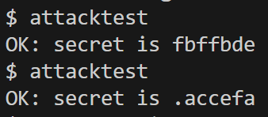

2. **修改 secret.c 验证**：  
   - 将 secret.c 中的 `32` 改为 `0`，攻击将失败，因为数据位置改变。  
   - 原因：attack 仍从偏移量 32 处读取，而秘密数据实际存储在页起始位置。

### 六、遇到的问题与解决方案
1. **攻击失败**：  
   - **问题**：多次运行 attacktest 有时成功有时失败。  
   - **解决方案**：增加内存碎片制造的复杂度（如多次申请/释放不同大小的内存块），提高内存复用的概率。

2. **地址计算错误**：  
   - **问题**：直接使用 `p + 32` 而非 `PGROUNDDOWN(p) + 32`，导致读取位置偏差。  
   - **解决方案**：严格按页对齐计算地址，确保与 secret.c 的内存布局一致。

3. **内存分配策略变化**：  
   - **问题**：不同版本的 xv6 内存分配策略可能不同，导致攻击代码失效。  
   - **解决方案**：通过调试工具（如添加打印语句）观察内存分配模式，调整攻击策略。
  
### 七、实验心得
1. **内存安全的重要性**：  
   - 即使是看似无害的代码省略（如未清零内存），也可能导致严重的安全漏洞。

2. **内核编程的挑战**：  
   - 内核需要处理复杂的资源管理，任何疏忽都可能被利用，强调了代码审查和测试的重要性。

3. **漏洞利用的本质**：  
   - 利用系统的确定性行为（如内存分配策略），通过精心设计的操作序列重现特定场景。