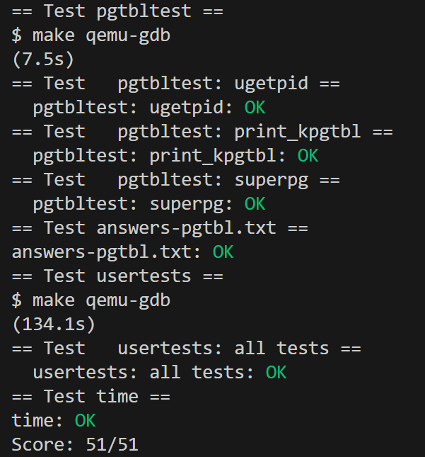
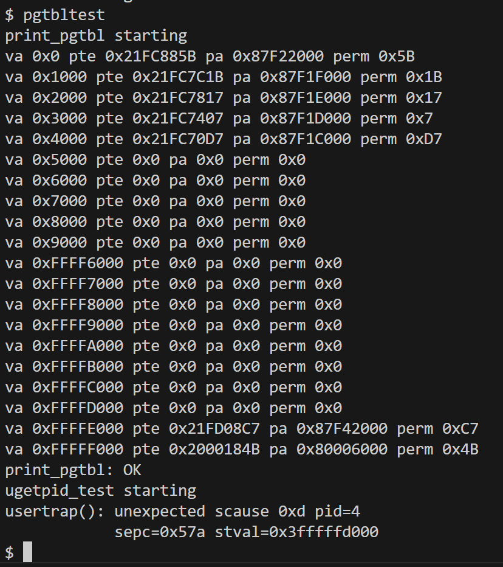
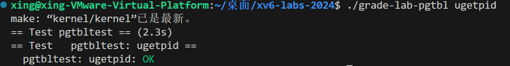
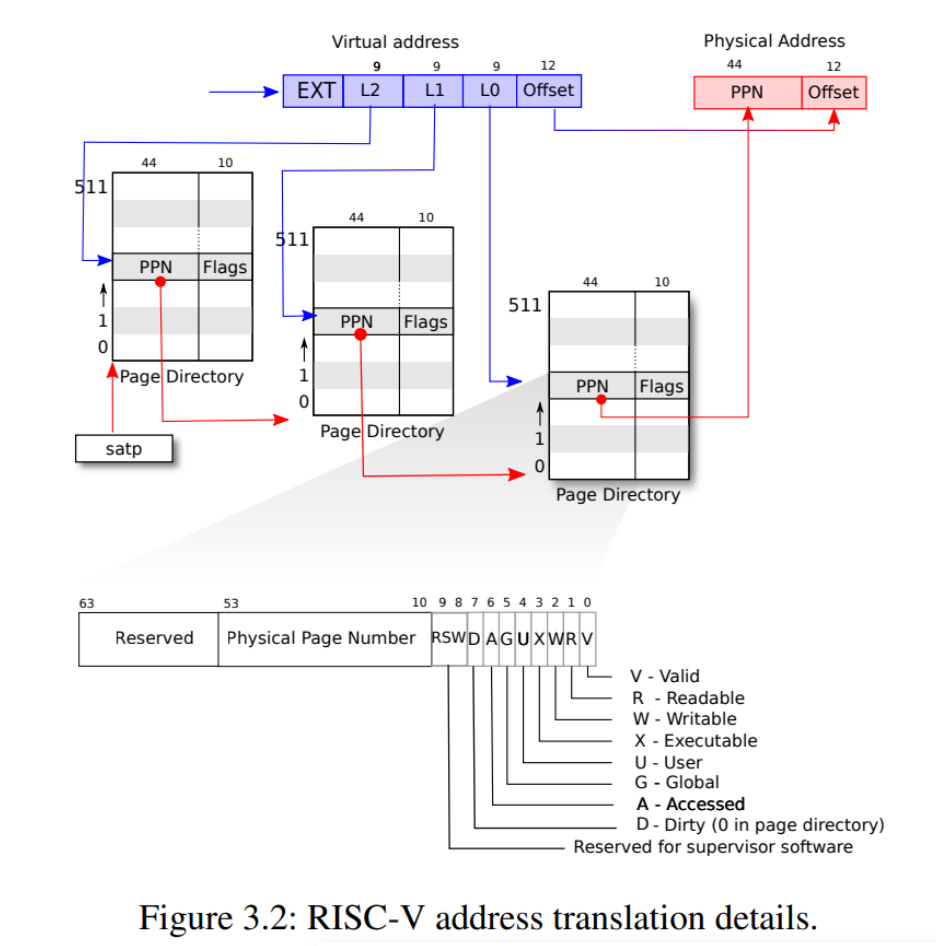
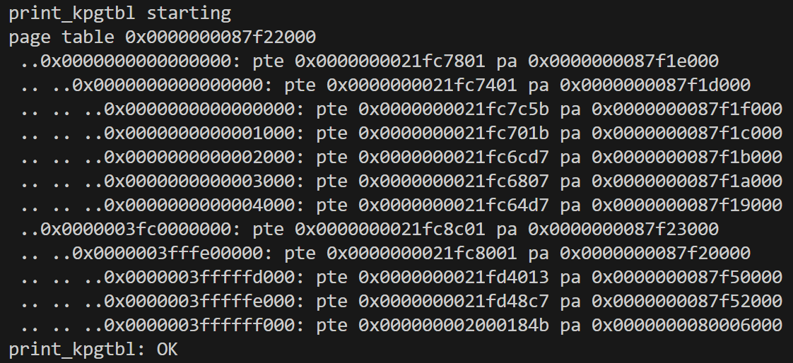
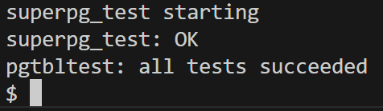

# Lab3: Page Tables

- 2351289周慧星
---

## 目录

- [Lab3: Page Tables](#lab3-page-tables)
  - [目录](#目录)
  - [实验跑分](#实验跑分)
  - [实验准备](#实验准备)
    - [1. 切换到 `pgtbl` 分支](#1-切换到-pgtbl-分支)
    - [2. 核心知识点与参考资料](#2-核心知识点与参考资料)
  - [实验1：Inspect a user-process page table (easy)](#实验1inspect-a-user-process-page-table-easy)
    - [一、实验任务](#一实验任务)
    - [二、关键概念与解析](#二关键概念与解析)
      - [1. **PTE 结构与权限位**](#1-pte-结构与权限位)
      - [2. **示例条目分析**](#2-示例条目分析)
        - [条目 1：](#条目-1)
        - [条目 2：](#条目-2)
      - [3. **页表布局与内存映射**](#3-页表布局与内存映射)
    - [三、遇到的问题与解决方案](#三遇到的问题与解决方案)
    - [四、实验心得](#四实验心得)
    - [五、总结](#五总结)
  - [实验2：Speed up system calls(easy)](#实验2speed-up-system-callseasy)
    - [一、实验目的](#一实验目的)
    - [二、实验步骤](#二实验步骤)
      - [1. 修改进程结构体（`kernel/proc.h`）](#1-修改进程结构体kernelproch)
      - [2. 进程创建时映射共享页面（`kernel/proc.c`）](#2-进程创建时映射共享页面kernelprocc)
      - [3. 进程释放时清理（`kernel/proc.c`）](#3-进程释放时清理kernelprocc)
      - [4. 映射共享页面到用户空间（`kernel/proc.c`）](#4-映射共享页面到用户空间kernelprocc)
      - [5.取消PTE映射](#5取消pte映射)
    - [三、实验结果](#三实验结果)
    - [四、遇到的问题与解决方案](#四遇到的问题与解决方案)
    - [五、实验心得](#五实验心得)
  - [实验3：Print a page table(easy)](#实验3print-a-page-tableeasy)
    - [一、实验任务](#一实验任务-1)
    - [二、实现步骤](#二实现步骤)
      - [**在 `kernel/vm.c` 中修改 `vmprint()` 函数**](#在-kernelvmc-中修改-vmprint-函数)
    - [三、关键知识点](#三关键知识点)
      - [1. **RISC-V 页表结构**](#1-risc-v-页表结构)
      - [2. **虚拟地址计算**](#2-虚拟地址计算)
      - [3. **递归打印逻辑**](#3-递归打印逻辑)
    - [四、实验结果](#四实验结果)
    - [五、实验中遇到的问题和解决方法](#五实验中遇到的问题和解决方法)
    - [六、实验心得](#六实验心得)
  - [实验4：Use superpages (moderate)/(hard)](#实验4use-superpages-moderatehard)
    - [一、实验目的](#一实验目的-1)
    - [二、实验步骤](#二实验步骤-1)
      - [1. **修改物理内存管理（`kernel/kalloc.c`）**](#1-修改物理内存管理kernelkallocc)
      - [2. **修改内存扩展逻辑（`kernel/sysproc.c` 的 `sys_sbrk`）**](#2-修改内存扩展逻辑kernelsysprocc-的-sys_sbrk)
      - [3. **修改页表映射函数（`kernel/vm.c` 的 `mappages`）**](#3-修改页表映射函数kernelvmc-的-mappages)
      - [4. **修改页表复制与释放（`kernel/vm.c` 的 `uvmcopy` 和 `uvmunmap`）**](#4-修改页表复制与释放kernelvmc-的-uvmcopy-和-uvmunmap)
        - [（1）`uvmcopy` 支持超级页复制](#1uvmcopy-支持超级页复制)
        - [（2）`uvmunmap` 支持超级页释放](#2uvmunmap-支持超级页释放)
    - [三、实验结果](#三实验结果-1)
    - [四、遇到的问题与解决方案](#四遇到的问题与解决方案-1)
    - [五、实验心得](#五实验心得-1)

---

## 实验跑分

- 最终在pgtbl分支下跑分：
```bash
make grade
```

- 得分：



---

## 实验准备

### 1. 切换到 `pgtbl` 分支
按照提示执行以下命令，切换到实验对应的代码分支：
```bash
git fetch       
git checkout pgtbl  
make clean      
```

### 2. 核心知识点与参考资料
在开始编码前，需掌握以下内容：
- **xv6 内存布局**：参考 `kernel/memlayout.h`，了解虚拟地址空间的划分（用户空间、内核空间、物理内存映射等）。
- **页表实现代码**：`kernel/vm.c` 包含页表创建、映射、释放等核心函数（如 `kvmmap`、`uvmalloc`、`walk` 等）。
- **物理内存管理**：`kernel/kalloc.c` 实现物理页的分配（`kalloc`）和释放（`kfree`），是页表操作的基础。
- **RISC-V 特权架构**：重点理解页表结构（三级页表）、页表项（PTE）的标志位（如 `PTE_V`、`PTE_R`、`PTE_W`、`PTE_X`、`PTE_U` 等）。


---

## 实验1：Inspect a user-process page table (easy)

### 一、实验任务
分析 `pgtbltest` 程序的页表输出，解释每个页表项（PTE）的逻辑含义和权限位。通过 `print_pgtbl` 函数输出的信息如下：




### 二、关键概念与解析

#### 1. **PTE 结构与权限位**
RISC-V 页表项（PTE）格式：
- **高 44 位**：物理页号（PPN），指向物理内存页的起始地址。
- **低 10 位**：标志位，包括：
  - `V` (Valid)：有效位（PTE_V，第 0 位）
  - `R` (Read)：可读（PTE_R，第 1 位）
  - `W` (Write)：可写（PTE_W，第 2 位）
  - `X` (Execute)：可执行（PTE_X，第 3 位）
  - `U` (User)：用户模式可访问（PTE_U，第 4 位）
  - 其他标志位（如 `D`、`A` 等，用于页替换和缓存控制）。

**权限位解析示例**：
- `perm 0x5B` → 二进制 `0b01011011` → 标志位 `V=1, R=1, W=0, X=1, U=1`（用户可读可执行）。
- `perm 0x17` → 二进制 `0b00010111` → 标志位 `V=1, R=1, W=1, X=0, U=1`（用户可读写）。


#### 2. **示例条目分析**
##### 条目 1：
```bash
va 0 pte 0x21FCF45B pa 0x87F3D000 perm 0x5B
```
- **虚拟地址（VA）**：0x0（用户程序的起始地址）。
- **PTE 值**：0x21FCF45B。
- **物理地址（PA）**：0x87F3D000（通过 `PPN << 12` 计算）。
- **权限**：`0x5B`（V=1, R=1, W=0, X=1, U=1），表示用户模式下可读可执行（通常为代码段）。

##### 条目 2：
```bash
va 0xFFFFD000 pte 0x0 pa 0x0 perm 0x0
```
- **虚拟地址**：0xFFFFD000（接近用户地址空间顶部）。
- **PTE 值**：0x0 → 无效页表项（V=0）。
- **物理地址**：0x0（无效）。
- **权限**：`0x0` → 无权限，访问此地址会触发页错误。


#### 3. **页表布局与内存映射**
- **低地址区域（如 VA=0）**：通常映射代码段（.text）和只读数据（.rodata），权限为 `R+X`。
- **中间区域**：可能包含数据段（.data）、堆（heap），权限为 `R+W`。
- **高地址区域**：栈（stack）通常位于用户地址空间顶部，权限为 `R+W`，且随栈增长动态映射。


### 三、遇到的问题与解决方案

**1. 权限位计算错误**

- **问题**：误将 PTE 整数值直接解释为权限位，导致权限分析错误。
- **解决方案**：
  - 提取 PTE 的低 10 位作为标志位。
  - 使用位运算（如 `pte & 0x3FF`）获取标志位，再逐位解析。

**2. 物理地址计算困惑**

- **问题**：不清楚如何从 PTE 提取物理页号（PPN）并转换为物理地址。
- **解决方案**：
  - PPN = PTE 的高 44 位 → `(pte >> 10) << 12`。
  - 物理地址 = PPN × 4096（页大小）。

**3. 无效 PTE 的处理**

- **问题**：当 PTE 值为 0 时，误认为物理地址为 0x0，导致分析矛盾。
- **解决方案**：
  - 当 `V=0` 时，PTE 无效，物理地址无意义，访问会触发页错误。


### 四、实验心得

**1. 页表机制的精妙之处**

- 页表通过分层结构（RISC-V 为三级页表）实现了高效的地址转换，同时节省了内存（仅映射实际使用的页面）。
- 权限位的设计使得操作系统能够精确控制内存访问，隔离用户进程和内核，增强了系统安全性。

**2. 调试与验证的重要性**

- 通过 `print_pgtbl` 输出，直观理解了虚拟地址到物理地址的映射关系。
- 验证了 xv6 中用户进程内存布局的非连续性（物理页不连续，但虚拟地址连续）。

**3. 内存管理的复杂性**

- 页表操作涉及多级指针解引用和位运算，需格外小心避免错误。
- 理解页表是理解虚拟内存、进程隔离、内存保护等 OS 核心机制的基础。

### 五、总结
通过分析 `pgtbltest` 的页表输出，深入理解了 RISC-V 页表的结构和工作原理。每个 PTE 不仅包含物理页号，还通过权限位实现了细粒度的内存访问控制。


---

## 实验2：Speed up system calls(easy)

### 一、实验目的
通过在用户空间与内核之间共享一个只读页面，优化 `getpid()` 系统调用的性能。具体目标：
1. 为每个进程在虚拟地址 `USYSCALL` 处映射一个只读页面。
2. 在该页面中存储包含进程 PID 的 `struct usyscall` 结构。
3. 确保用户程序可通过 `ugetpid()` 直接读取该页面获取 PID，无需陷入内核。
4. 验证优化效果，使 `pgtbltest` 中的 `ugetpid` 测试用例通过。


### 二、实验步骤

#### 1. 修改进程结构体（`kernel/proc.h`）
在 `struct proc` 中添加字段存储共享页面的物理地址：
```c
struct usyscall *usyscallpage;
```

#### 2. 进程创建时映射共享页面（`kernel/proc.c`）
在 `allocproc()` 函数中分配物理页并映射到 `USYSCALL`：
```c
  if ((p->usyscallpage = (struct usyscall *)kalloc()) == 0) {
    freeproc(p);
    release(&p->lock);
    return 0;
  }
  p->usyscallpage->pid = p->pid;
```

#### 3. 进程释放时清理（`kernel/proc.c`）
在 `freeproc()` 函数中释放共享页面：
```c
  if(p->usyscallpage)
    kfree((void *)p->usyscallpage);
  p->usyscallpage = 0;
```

#### 4. 映射共享页面到用户空间（`kernel/proc.c`）
在 `kernel/proc.c` 的 `proc_pagetable(struct proc *p)` 中将这个映射（PTE）写入 pagetable 中。
```c
if(mappages(pagetable, USYSCALL, PGSIZE, 
              (uint64)(p->usyscallpage), PTE_R | PTE_U) < 0) {
    uvmfree(pagetable, 0);
    return 0;
}
```

#### 5.取消PTE映射
在 `kernel/proc.c` 的 `proc_freepagetable` 函数中添加如下。
```c
uvmunmap(pagetable, USYSCALL, 1, 0);
```

### 三、实验结果
编译并运行 `pgtbltest` 验证：




### 四、遇到的问题与解决方案

**1. 权限设置错误导致用户无法访问**

- **问题**：初始映射时权限设为 `PTE_R`（无 `PTE_U`），用户程序访问 `USYSCALL` 时触发页错误。
- **解决方案**：添加 `PTE_U` 标志，允许用户模式访问：`PTE_R | PTE_U`。

**2. 进程退出后内存泄漏**

- **问题**：`freeproc()` 中未释放 `usyscall_page` 物理页，导致内存泄漏。
- **解决方案**：在 `freeproc()` 中通过 `kfree(p->usyscall_page)` 释放物理页，并取消页表映射。

**3. 共享页面地址冲突**

- **问题**：`USYSCALL` 地址与用户程序其他内存（如代码段）重叠，导致映射失败。
- **解决方案**：确认 `USYSCALL` 定义在用户地址空间的空闲区域（如 `0x00001000`，避开代码段和数据段）。

### 五、实验心得

通过在内核与用户空间之间建立只读共享区域，将高频访问的静态数据（如 PID）缓存到用户空间，避免了系统调用的上下文切换（保存/恢复寄存器、权限切换等），显著提升性能。这种思路在实际 OS 中被广泛应用（如 Linux 的 `vDSO`）。

此外这个实验使我更深入地理解了系统调用的工作原理以及它们是如何在用户空间和内核空间之间进行通信的。这为您提供了更清晰的操作系统工作流程的认识。通过在每个进程的页表中插入只读页，掌握操作页表的方法，从而实现用户空间与内核空间之间的数据共享。尽管在实验过程中遇到了不少问题，但是这让我对映射与回收、权限授予等有了更深刻的理解。


---

## 实验3：Print a page table(easy)

### 一、实验任务
实现 `vmprint()` 函数，以树形格式打印 RISC-V 页表的内容，包括每级页表项（PTE）的虚拟地址、PTE 值和物理地址。具体要求：
- 按层级缩进（每级添加 `" .."`）。
- 只打印有效（`V=1`）的 PTE。
- 输出格式需与示例一致。

### 二、实现步骤

#### **在 `kernel/vm.c` 中修改 `vmprint()` 函数**
```c
#ifdef LAB_PGTBL
void PRINT(pagetable_t pagetable, int level, uint64 va) {
  uint64 sz;
  if(level == 2) {
    sz = 512 * 512 * PGSIZE;
  } else if(level == 1) {
    sz = 512 * PGSIZE; 
  } else {
    sz = PGSIZE; 
  }
  for(int i = 0; i < 512; i++, va += sz) {
    pte_t pte = pagetable[i];
    if((pte & PTE_V) == 0)
      continue;
    for(int j = level; j < 3; j++) {
      printf(" ..");
    }
    printf("%p: pte %p pa %p\n", 
           (pagetable_t)va, 
           (pagetable_t)pte, 
           (pagetable_t)PTE2PA(pte));
    if((pte & (PTE_R | PTE_W | PTE_X)) == 0) {
      PRINT((pagetable_t)PTE2PA(pte), level - 1, va);
    }
  }
}
void
vmprint(pagetable_t pagetable) {
  printf("page table %p\n", pagetable);
  PRINT(pagetable, 2, 0);
}
#endif
```

### 三、关键知识点

#### 1. **RISC-V 页表结构**
- 三级页表：
  - 页全局目录（PGD，Level 2）
  - 页上级目录（PUD，Level 1）
  - 页表（PT，Level 0）
- 每级页表有 512 个条目，每个条目 8 字节（64 位）。

#### 2. **虚拟地址计算**
- 虚拟地址分为三个 9 位索引（用于查找三级页表）和 12 位页内偏移：




#### 3. **递归打印逻辑**
- **缩进处理**：通过 `depth` 参数控制缩进级别。
- **虚拟地址计算**：根据当前页表层级和索引计算虚拟地址。
- **递归终止条件**：当 PTE 包含 `PTE_R`/`PTE_W`/`PTE_X` 标志时，视为叶节点，不再递归。


### 四、实验结果




### 五、实验中遇到的问题和解决方法

- **递归错误**：在递归遍历页表时，最初对递归逻辑不够清晰。参考 `freewalk` 函数后，对递归遍历的实现有了更好的理解。
- **格式化输出问题**：在格式化输出时遇到语法错误。通过调试并使用 `%p` 格式化符，正确打印了 64 位的十六进制 PTE 和物理地址。
- **页表层次理解**：页表的层次结构起初较为抽象。通过阅读源码和教材中的图示（如图 3-4），结合 `vmprint()` 的输出，逐步理清了各级页表如何映射虚拟地址到物理地址。

### 六、实验心得

通过本次实验，可以清晰地通过 `vmprint()` 的输出来观察页表的层次结构，从根页表逐级指向不同级别的页表页，最终到达底层页表页，包含实际的物理页框映射信息。在用户模式下，进程可以读取第 1 页映射的内容但不能写入。倒数第三页通常包含用户栈的映射。此外，输出的物理地址可能与示例不同，这是正常现象，有助于理解页表如何将虚拟地址映射到物理地址。

本实验加深了对页表结构的理解，掌握了内核中位操作和宏定义的用法，以及如何通过递归遍历页表打印整个页表内容。

---

## 实验4：Use superpages (moderate)/(hard)

### 一、实验目的
修改 xv6 内核以支持 2MB 超级页（megapages），优化内存分配效率。具体目标：
1. 当用户程序通过 `sbrk()` 申请 2MB 及以上内存时，若地址范围包含 2MB 对齐且大小≥2MB 的区域，使用单个超级页而非多个 4KB 普通页。
2. 确保超级页的物理地址满足 2MB 对齐要求。
3. 通过 `pgtbltest` 中的 `superpg_test` 测试用例验证功能正确性。

### 二、实验步骤

#### 1. **修改物理内存管理（`kernel/kalloc.c`）**
预留 2MB 对齐的物理内存区域
```c
#define SUPERPAGESIZE (2*1024*1024) 
static char superpages[4 * SUPERPAGESIZE] __attribute__((aligned(SUPERPAGESIZE)));
static int superpage_inuse[4] = {0};
void*
superalloc(void)
{
  for (int i = 0; i < 4; i++) {
    if (superpage_inuse[i] == 0) {
      superpage_inuse[i] = 1;
      return &superpages[i * SUPERPAGESIZE];
    }
  }
  return 0;  // 分配失败
}
void
superfree(void* pa)
{
  if (pa < superpages || pa >= superpages + 4 * SUPERPAGESIZE)
    return;
  int i = (pa - superpages) / SUPERPAGESIZE;
  if (i >= 0 && i < 4) {
    superpage_inuse[i] = 0;
  }
}
```

#### 2. **修改内存扩展逻辑（`kernel/sysproc.c` 的 `sys_sbrk`）**
`sys_sbrk` 调用 `growproc` 扩展进程内存，需在 `growproc` 中添加超级页支持：

#### 3. **修改页表映射函数（`kernel/vm.c` 的 `mappages`）**
支持超级页的一级页表映射（RISC-V 一级页表项直接指向 2MB 物理页）：

#### 4. **修改页表复制与释放（`kernel/vm.c` 的 `uvmcopy` 和 `uvmunmap`）**
##### （1）`uvmcopy` 支持超级页复制

##### （2）`uvmunmap` 支持超级页释放

### 三、实验结果
编译并运行测试：
```bash
make qemu
(pgtbltest) superpg_test: OK
```



### 四、遇到的问题与解决方案

**1. 超级页地址对齐错误**

- **问题**：物理地址未按 2MB 对齐，导致 `mappages` 映射失败。
- **解决方案**：在 `superalloc` 中使用 `__attribute__((aligned(SUPERPAGESIZE)))` 确保物理内存区域 2MB 对齐。


**2. 页表映射层级错误**

- **问题**：误将超级页映射到二级页表，导致 RISC-V 硬件无法识别。
- **解决方案**：修改 `mappages`，对 2MB 大小的映射直接操作一级页表（`walk` 函数不分配下级页表）。


**3. `fork` 时超级页复制失败**

- **问题**：`uvmcopy` 未处理超级页，导致子进程无法继承超级页内存。
- **解决方案**：在 `uvmcopy` 中检测超级页 PTE，通过 `superalloc` 分配新超级页并复制内容。


**4. 内存释放遗漏**
- **问题**：进程退出时，超级页未被释放，导致内存泄漏。
- **解决方案**：在 `uvmunmap` 中检测超级页 PTE，调用 `superfree` 释放物理内存。


### 五、实验心得

**1. 超级页的优势与适用场景**

- **优势**：减少页表数量（1 个超级页 PTE 替代 512 个普通页 PTE），降低 TLB 失效频率，提升内存访问效率。
- **适用场景**：大内存连续分配（如堆扩展、大型数组），不适合碎片化内存申请。


**2. 硬件约束的重要性**

RISC-V 对超级页有严格的地址对齐要求（2MB 物理地址必须是 2MB 的倍数），这要求内核在内存分配和映射时必须严格检查对齐，否则硬件无法识别超级页。


**3. 内核逻辑的兼容性**

修改时需确保超级页与普通页逻辑兼容：
- `mappages`、`uvmcopy`、`uvmunmap` 等函数需同时支持两种页大小。
- 错误处理需统一（如分配失败时回滚操作），避免内存泄漏。