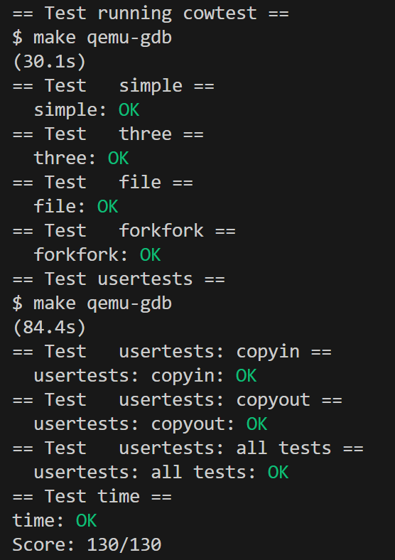
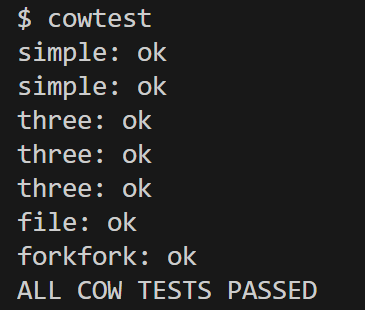
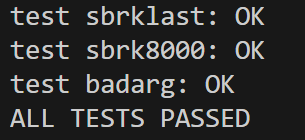

# Lab5: Copy-on-Write Fork for xv6

- 2351289周慧星
---

## 目录

- [Lab5: Copy-on-Write Fork for xv6](#lab5-copy-on-write-fork-for-xv6)
  - [目录](#目录)
  - [实验跑分](#实验跑分)
  - [实验概述](#实验概述)
    - [前置知识](#前置知识)
      - [**核心概念**](#核心概念)
    - [实验准备](#实验准备)
  - [实验1：Implement copy-on-write fork(hard)](#实验1implement-copy-on-write-forkhard)
    - [一、实验目的](#一实验目的)
    - [二、实验步骤](#二实验步骤)
      - [1. 定义 COW 标志与引用计数结构](#1-定义-cow-标志与引用计数结构)
        - [（1）添加 COW 页表项标志](#1添加-cow-页表项标志)
        - [（2）实现物理页引用计数](#2实现物理页引用计数)
      - [2. 修改 `fork` 实现 COW 共享](#2-修改-fork-实现-cow-共享)
        - [重写 `uvmcopy` 函数](#重写-uvmcopy-函数)
      - [3. 处理 COW 页错误](#3-处理-cow-页错误)
        - [修改 `usertrap` 处理写时复制](#修改-usertrap-处理写时复制)
      - [4. 处理内核写操作（`copyout`）](#4-处理内核写操作copyout)
      - [5. 修正页释放逻辑](#5-修正页释放逻辑)
    - [三、实验结果](#三实验结果)
    - [四、实验中遇到的问题和解决方法](#四实验中遇到的问题和解决方法)
    - [五、实验心得](#五实验心得)

---

## 实验跑分

- 最终在cow分支下跑分：
```bash
make grade
```

- 得分：



---

## 实验概述
本实验将实现 **写时复制（Copy-on-Write, COW）** 机制的 `fork` 系统调用，优化 xv6 中进程创建的性能。传统 `fork` 会复制父进程的所有内存，而 COW 仅在父进程或子进程**首次修改内存页**时才复制该页，减少不必要的内存复制，提高效率。


### 前置知识
#### **核心概念**
- **写时复制（COW）**：`fork` 时不立即复制父进程内存，而是让父子进程共享所有内存页，并将这些页标记为**只读**。当任一进程尝试修改页时，触发页错误，内核此时才复制该页并更新页表，使修改对其他进程不可见。
- **页表项（PTE）标记**：利用 RISC-V 页表项的未使用标志位（如 `PTE_COW`）标记共享的 COW 页，便于内核识别。
- **页错误处理**：当进程写入只读页时，CPU 触发页错误（`scause=13` 或 `15`），内核在 `usertrap` 中处理，完成复制后重新标记页为可写。

### 实验准备
**切换到实验分支**：
 ```bash
   git fetch
   git checkout cow
   make clean  # 清除旧编译产物
```

---

## 实验1：Implement copy-on-write fork(hard)

### 一、实验目的
1. 实现基于写时复制（Copy-on-Write, COW）的 `fork` 系统调用，优化 xv6 中进程创建的性能。
2. 理解虚拟内存的间接性原理，通过页表权限控制和页错误机制实现内存的延迟复制。
3. 掌握物理页引用计数的管理方法，确保内存正确分配与释放。
4. 验证 COW 机制的正确性，确保通过 `cowtest` 和 `usertests -q` 测试。


### 二、实验步骤

#### 1. 定义 COW 标志与引用计数结构
##### （1）添加 COW 页表项标志
在 `kernel/riscv.h` 中定义 `PTE_COW` 标志（使用 PTE 的预留位）：
```c
#define PTE_COW (1L << 8)  
```

##### （2）实现物理页引用计数
在 `kernel/kalloc.c` 中添加引用计数管理：
```c
struct {
  struct spinlock lock;
  int cnt[PHYSTOP / PGSIZE]; 
} kref;
void krefinit() {
  initlock(&kref.lock, "kref");
}
void krefinc(uint64 pa) {
  acquire(&kref.lock);
  kref.cnt[(pa)/PGSIZE]++;
  release(&kref.lock);
}
void krefdec(uint64 pa) {
  acquire(&kref.lock);
  int idx = (pa)/PGSIZE;
  if (kref.cnt[idx] == 0)
    panic("krefdec: underflow");
  kref.cnt[idx]--;
  int cnt = kref.cnt[idx];
  release(&kref.lock);
  if (cnt == 0) {
    struct run *r = (struct run*)pa;
    r->next = kmem.freelist;
    kmem.freelist = r;
  }
}
```

在 `kinit()` 中初始化引用计数：
```c
void kinit() {
  krefinit();  // 初始化引用计数
  // 原有内存初始化逻辑...
}
```

#### 2. 修改 `fork` 实现 COW 共享
##### 重写 `uvmcopy` 函数
修改 `kernel/vm.c` 的 `uvmcopy`，实现父子进程共享物理页（而非复制）：
```c
int uvmcopy(pagetable_t old, pagetable_t new, uint64 sz) {
  pte_t *pte;
  uint64 va, pa;

  for (va = 0; va < sz; va += PGSIZE) {
    if ((pte = walk(old, va, 0)) == 0)
      panic("uvmcopy: pte not found");
    if ((*pte & PTE_V) == 0)
      panic("uvmcopy: pte not valid");

    pa = PTE2PA(*pte);
    if (pa == 0) continue;  // 跳过未分配页

    // 增加物理页引用计数（共享该页）
    krefinc(pa);

    // 标记父进程PTE为只读+COW
    *pte &= ~PTE_W;  // 清除写权限
    *pte |= PTE_COW;  // 添加COW标记

    // 子进程页表映射相同物理页，权限与父进程一致（只读+COW）
    uint64 perm = (PTE_FLAGS(*pte) | PTE_V) & ~PTE_W;
    if (mappages(new, va, PGSIZE, pa, perm) != 0) {
      // 映射失败，回滚释放子进程已映射的页
      uvmunmap(new, 0, va/PGSIZE, 1);
      return -1;
    }
  }
  return 0;
}
```


#### 3. 处理 COW 页错误
##### 修改 `usertrap` 处理写时复制
在 `kernel/trap.c` 的 `usertrap` 中添加页错误处理逻辑：
```c
void usertrap() {
  struct proc *p = myproc();
  // 原有代码...

  // 检查是否为页错误（加载/存储访问异常）
  if (r_scause() == 13 || r_scause() == 15) {
    uint64 va = r_stval();  // 错误地址
    va = PGROUNDDOWN(va);   // 页对齐

    pte_t *pte = walk(p->pagetable, va, 0);
    // 验证是否为COW页（存在且标记为COW）
    if (pte == 0 || (*pte & (PTE_V | PTE_COW)) != (PTE_V | PTE_COW)) {
      // 非COW页错误，杀死进程
      p->killed = 1;
    } else {
      // 分配新物理页
      char *newpa = kalloc();
      if (newpa == 0) {
        p->killed = 1;  // 内存不足，杀死进程
      } else {
        // 复制旧页内容到新页
        uint64 oldpa = PTE2PA(*pte);
        memmove(newpa, (char*)oldpa, PGSIZE);

        // 减少旧页引用计数
        krefdec(oldpa);

        // 映射新页到当前进程，恢复写权限
        uint64 perm = PTE_V | PTE_R | PTE_W | PTE_U;
        if (mappages(p->pagetable, va, PGSIZE, (uint64)newpa, perm) != 0) {
          kfree(newpa);
          p->killed = 1;
        }
      }
    }
  }

  // 原有代码...
}
```


#### 4. 处理内核写操作（`copyout`）
修改 `kernel/vm.c` 的 `copyout` 函数，支持 COW 页的内核写入：
```c
int copyout(pagetable_t pagetable, uint64 dstva, char *src, uint64 len) {
  while (len > 0) {
    uint64 va0 = PGROUNDDOWN(dstva);
    pte_t *pte = walk(pagetable, va0, 0);

    // 检查是否为COW页，若为则复制新页
    if (pte && (*pte & (PTE_V | PTE_COW)) == (PTE_V | PTE_COW)) {
      uint64 oldpa = PTE2PA(*pte);
      char *newpa = kalloc();
      if (newpa == 0) return -1;

      // 复制旧页内容
      memmove(newpa, (char*)oldpa, PGSIZE);
      // 减少旧页引用计数
      krefdec(oldpa);
      // 映射新页（可写）
      uint64 perm = PTE_V | PTE_R | PTE_W | PTE_U;
      if (mappages(pagetable, va0, PGSIZE, (uint64)newpa, perm) != 0) {
        kfree(newpa);
        return -1;
      }
      pte = walk(pagetable, va0, 0);  // 重新获取pte
    }

    // 原有复制逻辑...
  }
  return 0;
}
```


#### 5. 修正页释放逻辑
修改 `kernel/vm.c` 的 `uvmunmap`，确保解除映射时减少引用计数：
```c
void uvmunmap(pagetable_t pagetable, uint64 va, uint64 npages, int do_free) {
  // 原有循环...
  for (i = 0; i < npages; i++, va += PGSIZE) {
    pte_t *pte = walk(pagetable, va, 0);
    if (pte == 0) continue;
    if ((*pte & PTE_V) == 0) continue;

    uint64 pa = PTE2PA(*pte);
    *pte = 0;  // 清除页表项

    // 减少引用计数（do_free表示需要释放）
    if (do_free || (*pte & PTE_COW)) {
      krefdec(pa);
    }
  }
  // 原有代码...
}
```


### 三、实验结果
1. **`cowtest` 测试**：
```bash
   $ cowtest
```



2. **`usertests -q` 测试**：
```bash
   $ usertests -q
```



所有测试通过，表明 COW 机制实现正确：
- `simple` 测试验证了内存不足时 COW 能成功创建进程。
- `three` 测试验证了多进程共享与复制的正确性。
- `file` 测试验证了文件映射页的 COW 处理。
- `usertests` 验证了 COW 机制对其他内核功能无干扰。


### 四、实验中遇到的问题和解决方法
1. **引用计数同步问题**：
   - **问题**：多进程并发修改引用计数导致计数错误。
   - **解决**：在 `krefinc` 和 `krefdec` 中使用自旋锁（`spinlock`）保证原子操作。

2. **`copyout` 写入 COW 页失败**：
   - **问题**：内核通过 `copyout` 写入 COW 页时未触发复制，导致写失败。
   - **解决**：在 `copyout` 中添加 COW 页检测逻辑，同 `usertrap` 处理方式复制新页。

3. **页错误无限循环**：
   - **问题**：新页映射后未清除 `PTE_COW` 标志，导致重复触发页错误。
   - **解决**：新页映射时使用 `PTE_W` 权限且不设置 `PTE_COW`，避免再次被识别为 COW 页。

4. **内存泄漏**：
   - **问题**：进程退出时未正确减少 COW 页引用计数，导致物理页无法释放。
   - **解决**：在 `uvmunmap` 中强制对 COW 页调用 `krefdec`，确保引用计数归零。

5. **权限冲突**：
   - **问题**：文本段（只读页）被错误标记为 COW，导致写入时异常。
   - **解决**：仅对原可写页（`PTE_W` 为 1）设置 COW 标记，只读页保持原有权限。


### 五、实验心得
1. **延迟复制的优势**：COW 机制通过“按需复制”避免了 `fork` 时的大量冗余内存复制，显著提升了进程创建效率，尤其适合内存密集型应用。

2. **虚拟内存的灵活性**：通过修改页表项权限（只读）和自定义标志（`PTE_COW`），内核能精确控制内存访问，体现了虚拟内存“间接性”的强大能力。

3. **引用计数的重要性**：正确的引用计数管理是 COW 机制的核心，它确保物理页在最后一个引用消失时才被释放，避免内存泄漏或悬垂引用。

在实验过程中，我遇到了关于处理页面故障的问题。刚开始时，我对于如何确定页面故障以及如何获取相应的异常代码和地址信息感到困惑。然而，通过查阅 RISC-V 架构规范和相关文档，我逐渐理解了异常处理的流程，并找到了解决方法。

我发现 RISC-V 架构规范提供了一个清晰的表格，列出了各种异常代码和异常类型的对应关系。这个表格不仅告诉我们异常代码为 15 时对应于存储访问异常，也提供了同步异常的优先级等信息。通过阅读这些信息，我能够正确地识别和处理存储访问异常。
