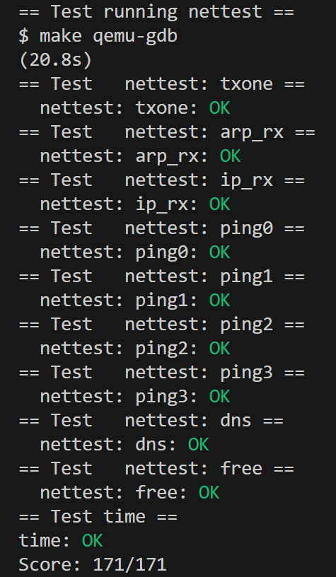
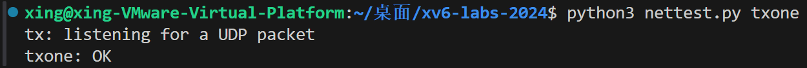
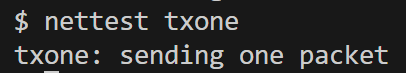
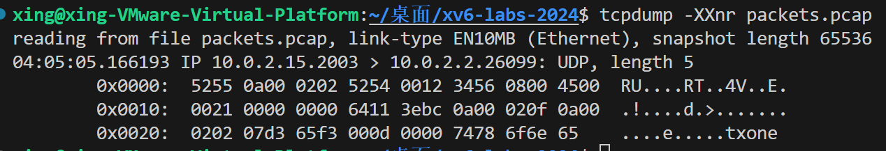
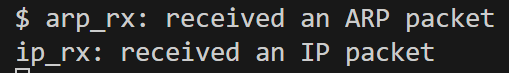
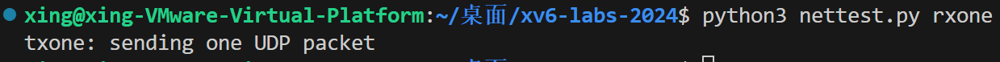
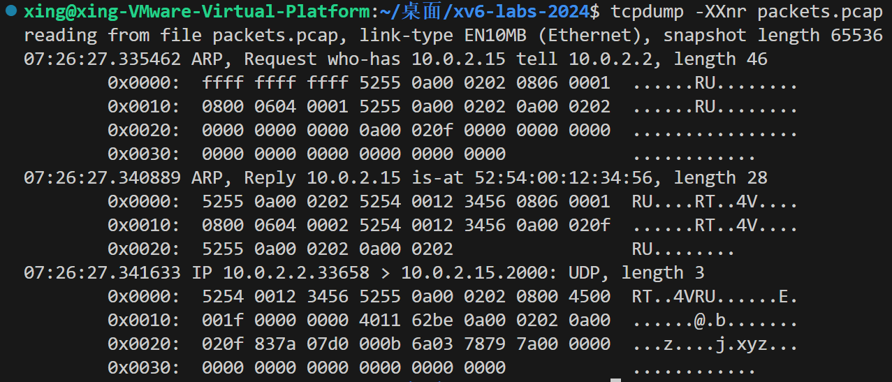
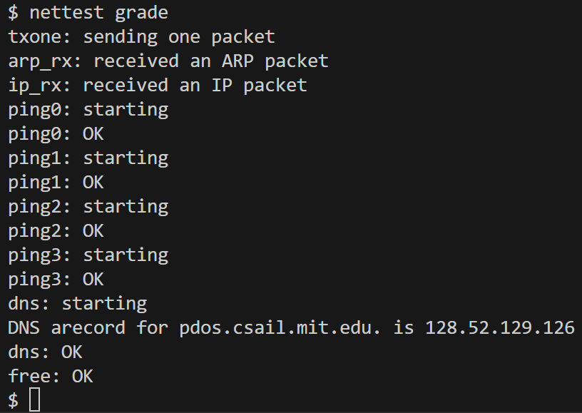
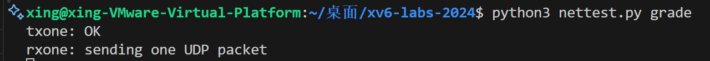

# Lab6: networking

- 2351289周慧星
--- 
## 目录

- [Lab6: networking](#lab6-networking)
  - [目录](#目录)
  - [实验跑分](#实验跑分)
  - [实验概述](#实验概述)
    - [实验准备](#实验准备)
  - [实验背景](#实验背景)
    - [1. E1000 网卡简介](#1-e1000-网卡简介)
    - [2. 网络协议栈](#2-网络协议栈)
    - [3. 关键文件](#3-关键文件)
  - [实验1：Part One: NIC (moderate)](#实验1part-one-nic-moderate)
    - [一、实验目的](#一实验目的)
    - [二、E1000 驱动核心原理](#二e1000-驱动核心原理)
    - [三、实验步骤](#三实验步骤)
      - [1. 实现数据包发送（`e1000_transmit`）](#1-实现数据包发送e1000_transmit)
        - [代码实现](#代码实现)
        - [关键逻辑](#关键逻辑)
      - [2. 实现数据包接收（`e1000_recv`）](#2-实现数据包接收e1000_recv)
        - [代码实现](#代码实现-1)
        - [关键逻辑](#关键逻辑-1)
    - [四、实验结果](#四实验结果)
      - [1. 发送测试（txone）,测试`e1000_transmit()`。](#1-发送测试txone测试e1000_transmit)
      - [2. 接收测试（rxone），测试 `e1000_recv()`。](#2-接收测试rxone测试-e1000_recv)
    - [五、遇到的问题与解决方法](#五遇到的问题与解决方法)
    - [六、实验心得](#六实验心得)
  - [实验2：Part Two: UDP Receive (moderate)](#实验2part-two-udp-receive-moderate)
    - [一、实验目的](#一实验目的-1)
    - [二、实验步骤](#二实验步骤)
      - [1、数据结构添加](#1数据结构添加)
      - [2、初始化](#2初始化)
      - [3、`sys_bind()` 实现](#3sys_bind-实现)
      - [4、`ip_rx()` 实现](#4ip_rx-实现)
      - [5、`sys_recv()` 实现](#5sys_recv-实现)
    - [三、实验结果](#三实验结果)
    - [四、实验中遇到的问题及解决方法](#四实验中遇到的问题及解决方法)
    - [五、实验心得](#五实验心得)


---

## 实验跑分

- 最终在net分支下跑分：
```bash
make grade
```

- 得分：



---

## 实验概述
1. 为 xv6 实现 E1000 网卡设备驱动，支持网络数据包的接收和发送。
2. 完成以太网（Ethernet）、IP、UDP 协议栈的接收部分，实现用户进程与外界的 UDP 通信。
3. 理解中断驱动的设备编程、协议栈分层设计及网络数据包处理流程。

### 实验准备
**切换到实验分支**：
 ```bash
   git fetch
   git checkout net
   make clean  # 清除旧编译产物
```

---

## 实验背景
### 1. E1000 网卡简介
E1000 是 Intel 一款千兆以太网控制器，实验中通过 QEMU 模拟该网卡。驱动需与网卡的寄存器交互，完成数据包的收发：
- **发送**：驱动将数据包写入网卡的发送队列，触发发送。
- **接收**：网卡收到数据包后存入接收队列，通过中断通知内核处理。

### 2. 网络协议栈
xv6 已实现 UDP 发送逻辑，需补充接收逻辑，涉及三层协议：
- **以太网（Ethernet）**：处理 MAC 地址和帧类型。
- **IP**：处理 IP 地址、协议类型（如 UDP）和校验和。
- **UDP**：处理端口号，将数据包交付给对应用户进程。

### 3. 关键文件
- `kernel/e1000.c`：E1000 驱动实现（收发逻辑）。
- `kernel/e1000_dev.h`：E1000 寄存器和标志位定义。
- `kernel/net.c`/`net.h`：IP、UDP、ARP 协议处理（需补全接收逻辑）。
- `kernel/pci.c`：PCI 总线扫描，初始化 E1000 设备。

---

## 实验1：Part One: NIC (moderate)

### 一、实验目的
完成 `e1000_transmit()` 和 `e1000_recv()` 函数，实现 E1000 网卡的数据包发送和接收功能，通过 `txone` 和 `rxone` 测试。

### 二、E1000 驱动核心原理
E1000 网卡通过 **发送队列（TX Ring）** 和 **接收队列（RX Ring）** 与内核交互，队列由描述符（Descriptor）组成，每个描述符指向一个数据包缓冲区。驱动通过读写描述符和网卡寄存器完成数据收发。

### 三、实验步骤

- 全局锁 `e1000_lock`，保护发送/接收队列操作，避免中断与进程并发访问冲突。
- 在 `e1000_transmit` 和 `e1000_recv` 中加锁/解锁：

#### 1. 实现数据包发送（`e1000_transmit`）
将用户数据包添加到发送队列，通知网卡发送，并在发送完成后释放缓冲区。
##### 代码实现
```c
int e1000_transmit(void *buf, int len) {
  acquire(&e1000_lock);
  uint32 idx = regs[E1000_TDT] % TX_RING_SIZE;
  if (!(tx_ring[idx].status & E1000_TXD_STAT_DD)) {
    release(&e1000_lock);
    return -1; // 队列已满
  }
  if (tx_bufs[idx]) {
    kfree(tx_bufs[idx]);
  }
  tx_ring[idx].addr = (uint64)buf;
  tx_ring[idx].length = len;
  tx_ring[idx].cmd = E1000_TXD_CMD_EOP | E1000_TXD_CMD_RS;
  tx_bufs[idx] = buf; // 保存缓冲区指针
  regs[E1000_TDT] = (regs[E1000_TDT] + 1) % TX_RING_SIZE;
  release(&e1000_lock);
  return 0;
}
```

##### 关键逻辑
- **队列位置获取**：通过 `E1000_TDT` 寄存器获取当前可使用的发送描述符索引。
- **队列满判断**：检查描述符的 `DD`（Descriptor Done）标志，若未置位，说明前一个数据包未发送完成，队列满。
- **描述符设置**：`EOP`（End of Packet）标记数据包结束，`RS`（Report Status）请求发送完成后更新状态。
- **指针更新**：递增 `TDT` 告知网卡新数据包位置。


#### 2. 实现数据包接收（`e1000_recv`）
从接收队列读取新数据包，交给协议栈处理，并分配新缓冲区供下次接收。
##### 代码实现
```c
void e1000_recv(void) {
  while (1) {
    uint32 rdt = regs[E1000_RDT];
    uint32 idx = (rdt + 1) % RX_RING_SIZE;
    if (!(rx_ring[idx].status & E1000_RXD_STAT_DD)) {
      break; // 没有更多数据包
    }
    net_rx(rx_bufs[idx], rx_ring[idx].length);
    char *new_buf = kalloc();
    if (!new_buf) {
      panic("e1000: 无法分配新的接收缓冲区");
    }
    rx_ring[idx].addr = (uint64)new_buf;
    rx_ring[idx].status = 0;
    rx_bufs[idx] = new_buf;
    regs[E1000_RDT] = idx;
  }
}
```

##### 关键逻辑
- **新包检测**：通过 `DD` 标志判断描述符是否已被网卡更新（即有新数据包）。
- **协议栈交付**：调用 `net_rx` 将数据包交给上层协议处理。
- **缓冲区重置**：分配新缓冲区并更新描述符，确保下次接收有可用空间。
- **指针更新**：递增 `RDT` 告知网卡已处理完该数据包。

### 四、实验结果

#### 1. 发送测试（txone）,测试`e1000_transmit()`。
1. 在一个终端运行：
```bash
python3 nettest.py txone
```
2. 在另一个终端中运行：
```bash
make qemu
netteast txone
```
结果如下：



3. 接着在第一个终端输入：
```bash
tcpdump -XXnr packets.pcap
```
可看到包含 `txone` 的 UDP 包：



#### 2. 接收测试（rxone），测试 `e1000_recv()`。

1. 在一个终端运行：
```bash
make qemu
```
2. 在另一个终端中运行：
```bash
python3 nettest.py rxone
```
结果如下：



3. 接着在第二个终端输入：
```bash
tcpdump -XXnr packets.pcap
```
可看到 ARP 请求、ARP 回复和包含 `xyz` 的 UDP 包：



### 五、遇到的问题与解决方法

1. **发送队列满导致发送失败**
   - **问题**：`e1000_transmit` 频繁返回 -1。
   - **解决**：确保发送完成后释放缓冲区（`kfree`），并正确设置 `TDT` 指针。

2. **接收不到数据包**
   - **问题**：`e1000_recv` 未检测到新包。
   - **解决**：检查 `DD` 标志判断逻辑，确保 `RDT` 指针正确更新。

3. **并发冲突导致内核崩溃**
   - **问题**：中断与进程同时操作队列，导致数据不一致。
   - **解决**：在所有队列操作处加锁（`e1000_lock`），确保互斥访问。

4. **缓冲区泄漏**
   - **问题**：`kalloc` 分配的缓冲区未被 `kfree`，导致内存耗尽。
   - **解决**：在发送描述符的 `DD` 标志置位后，及时释放对应缓冲区。


### 六、实验心得
本部分实现了 E1000 网卡的核心收发功能，通过队列管理和中断处理，使 xv6 能够与外界进行基本的网络通信。关键在于理解描述符机制、寄存器交互及并发同步，为后续协议栈实现奠定基础。


---

## 实验2：Part Two: UDP Receive (moderate)

### 一、实验目的
实现 `ip_rx()`、`sys_recv()` 和 `sys_bind()` 函数，完成 UDP 数据包的接收、排队及用户进程交互功能，确保用户进程能通过 `recv()` 系统调用获取指定端口的 UDP 数据。

### 二、实验步骤

#### 1、数据结构添加
首先需要在`kernel/net.c` 中添加数据结构管理绑定的端口和对应的数据包队列：
```c
#define MAX_PACKETS 16  // 每个端口最大缓存包数
#define MAX_UDP_PORT 65535
// 存储 UDP 数据包的结构
struct udp_packet {
  struct udp_packet *next;  // 链表节点
  uint32 src_ip;            // 源 IP 地址
  uint16 src_port;          // 源端口
  int len;                  // 数据长度
  char data[0];             // 柔性数组存储数据
};
// 端口绑定信息及数据包队列
struct udp_bound {
  struct spinlock lock;     // 保护队列的锁
  struct udp_packet *head;  // 队列头
  struct udp_packet *tail;  // 队列尾
  int count;                // 当前包数
  int inuse;                // 是否被绑定
};
static struct udp_bound udp_ports[MAX_UDP_PORT + 1];  // 端口数组
static struct spinlock udp_global_lock;               // 全局锁（保护端口绑定）
```

#### 2、初始化
在 `net_init()` 中初始化锁和端口结构：
```c
void
netinit(void)
{
  initlock(&netlock, "netlock");
  
  // 初始化所有端口队列
  for (int i = 0; i <= MAX_PORT; i++) {
    initlock(&ports[i].lock, "port_queue");
    ports[i].head = ports[i].tail = 0;
    ports[i].count = 0;
    ports[i].bound = 0;
  }
}
```

#### 3、`sys_bind()` 实现
功能：绑定端口，标记端口为“正在使用”，允许接收该端口的 UDP 包。
```c
uint64
sys_bind(void)
{
  int port;
  if (argint(0, &port) < 0)
    return -1;
  // 检查端口有效性
  if (port < 0 || port > MAX_PORT)
    return -1;
  acquire(&ports[port].lock);
  // 检查是否已绑定
  if (ports[port].bound) {
    release(&ports[port].lock);
    return -1;
  }
  ports[port].bound = 1;
  release(&ports[port].lock);
  return 0;
}
```

#### 4、`ip_rx()` 实现
功能：解析 IP 包，提取 UDP 数据，将符合条件的包加入对应端口的队列。
```c
void
ip_rx(char *buf, int len)
{
  // 不删除此打印，make grade依赖它
  static int seen_ip = 0;
  if (seen_ip == 0)
    printf("ip_rx: received an IP packet\n");
  seen_ip = 1;
  // 检查缓冲区长度是否足够
  if (len < sizeof(struct eth) + sizeof(struct ip) + sizeof(struct udp)) {
    kfree(buf);
    return;
  }
  // 解析以太网头部
  struct eth *eth = (struct eth *)buf;
  // 解析IP头部
  struct ip *ip = (struct ip *)(eth + 1);
  int ip_header_len = (ip->ip_vhl & 0x0F) * 4;  // IP头部长度（字节）
  if (ip_header_len < sizeof(struct ip) || ip->ip_vhl >> 4 != 4) {
    kfree(buf);
    return;  // 不是IPv4或头部长度异常
  }
  // 只处理UDP协议
  if (ip->ip_p != IPPROTO_UDP) {
    kfree(buf);
    return;
  }
  // 解析UDP头部
  struct udp *udp = (struct udp *)((char *)ip + ip_header_len);
  uint16 dport = ntohs(udp->dport);  // 目的端口（网络字节序转主机字节序）
  uint16 sport = ntohs(udp->sport);  // 源端口
  uint16 udp_len = ntohs(udp->ulen); // UDP总长度（头部+数据）
  // 检查UDP长度有效性
  if (udp_len < sizeof(struct udp) || 
      (ip_header_len + udp_len) > (len - sizeof(struct eth))) {
    kfree(buf);
    return;
  }
  // 计算数据长度和数据位置
  int data_len = udp_len - sizeof(struct udp);
  char *data = (char *)udp + sizeof(struct udp);
  // 检查目的端口是否已绑定
  if (dport < 0 || dport > MAX_PORT || !ports[dport].bound) {
    kfree(buf);
    return;  // 端口未绑定，丢弃数据包
  }
  // 分配空间存储数据包
  struct udp_packet *p = kalloc();
  if (!p) {
    kfree(buf);
    return;  // 内存不足，丢弃
  }
  // 初始化数据包
  p->next = 0;
  p->src_ip = ntohl(ip->ip_src);  // 源IP（网络字节序转主机字节序）
  p->src_port = sport;
  p->len = data_len;
  memmove(p->data, data, data_len);  // 复制数据
  // 将数据包加入对应端口的队列
  struct port_queue *q = &ports[dport];
  acquire(&q->lock);
  // 若队列已满（超过MAX_UDP_PACKETS），丢弃新包
  if (q->count >= MAX_UDP_PACKETS) {
    release(&q->lock);
    kfree(p);
    kfree(buf);
    return;
  }
  // 将包加入队列尾部
  if (q->tail) {
    q->tail->next = p;
  } else {
    q->head = p;  // 队列为空时，头指针指向新包
  }
  q->tail = p;
  q->count++;
  // 唤醒等待该端口的进程
  wakeup(q);
  release(&q->lock);
  kfree(buf);  // 释放原始缓冲区
}
```

#### 5、`sys_recv()` 实现
功能：从指定端口的队列中获取最早的 UDP 包，复制数据到用户空间，若队列空则等待。
```c
uint64
sys_recv(void)
{
  int dport, maxlen;
  uint64 src_addr, sport_addr, buf_addr;
  // 解析系统调用参数
  if (argint(0, &dport) < 0 ||
      argaddr(1, &src_addr) < 0 ||
      argaddr(2, &sport_addr) < 0 ||
      argaddr(3, &buf_addr) < 0 ||
      argint(4, &maxlen) < 0)
    return -1;
  // 检查端口有效性
  if (dport < 0 || dport > MAX_PORT)
    return -1;
  struct port_queue *q = &ports[dport];
  acquire(&q->lock);
  // 检查端口是否已绑定
  if (!q->bound) {
    release(&q->lock);
    return -1;
  }
  // 等待队列中有数据包
  while (q->count == 0) {
    sleep(q, &q->lock);  // 释放锁并休眠，被唤醒时重新获得锁
  }
  // 取出队列头部的数据包
  struct udp_packet *p = q->head;
  q->head = p->next;
  if (q->head == 0) {
    q->tail = 0;  // 队列为空时更新尾指针
  }
  q->count--;
  release(&q->lock);  // 提前释放锁，减少持有时间
  // 复制源IP到用户空间
  int src_ip = p->src_ip;
  if (copyout(myproc()->pagetable, src_addr, (char *)&src_ip, sizeof(src_ip)) < 0) {
    kfree(p);
    return -1;
  }
  // 复制源端口到用户空间
  short src_port = p->src_port;
  if (copyout(myproc()->pagetable, sport_addr, (char *)&src_port, sizeof(src_port)) < 0) {
    kfree(p);
    return -1;
  }
  // 复制数据到用户空间
  int copy_len = p->len < maxlen ? p->len : maxlen;
  if (copyout(myproc()->pagetable, buf_addr, p->data, copy_len) < 0) {
    kfree(p);
    return -1;
  }
  // 释放数据包
  kfree(p);
  return copy_len;
}
```

### 三、实验结果
1. 在一个终端运行：
```bash
make qemu
nettest grade
```
2. 在另一个终端运行：
```bash
python3 nettest.py grade
```

结果如下：



通过以上修改，UDP 接收功能可正常工作，用户进程能通过 `bind()` 和 `recv()` 与外界进行 UDP 通信。

### 四、实验中遇到的问题及解决方法

**1. 数据结构类型不匹配错误**

**问题**：在实现E1000驱动时，出现`struct e1000_tx_desc`与`struct tx_desc`类型不匹配的编译错误。
**解决方法**：删除自定义的结构体定义，直接使用`e1000_dev.h`中定义的结构体类型，确保所有引用保持一致。同时将代码中错误的`tx_buf`变量名统一改为`tx_bufs`，与全局定义保持一致。

**1. 系统调用参数获取错误**

**问题**：在实现`sys_bind`和`sys_recv`时，使用`if (argint(0, &port) < 0)`判断参数获取是否成功，导致`void value not ignored`错误。
**解决方法**：了解到xv6中的`argint`、`argaddr`等函数返回值为`void`，不能用于条件判断，直接调用这些函数获取参数即可，无需判断返回值。

**3. 字节序转换问题**

**问题**：接收UDP数据包时，端口号和IP地址解析错误，导致数据包无法正确匹配到绑定的端口。
**解决方法**：使用`ntohs()`和`ntohl()`函数将网络字节序（大端）转换为主机字节序（小端），特别是对端口号和IP地址的处理必须进行字节序转换。

### 五、实验心得

通过本次实验，我清晰地认识到网络通信的分层结构：从底层的以太网帧（Ethernet），到IP层的数据包封装，再到UDP层的端口寻址，每一层都有明确的职责。特别是亲手实现从网卡接收数据到用户进程获取数据的完整流程，让我对"数据如何在网络中传输"有了具象化的理解。

网络协议中统一使用大端字节序，而RISC-V架构使用小端字节序，这种差异导致必须在数据收发时进行字节序转换。这个细节让我意识到，硬件架构和网络协议的设计差异会直接影响驱动程序的实现，也理解了`ntohs`等函数的实际作用。

在实现UDP数据包队列时，需要处理多进程并发访问的问题：发送方可能随时写入数据包，接收方可能阻塞等待新数据。通过锁机制和睡眠/唤醒机制的结合，既保证了数据一致性，又提高了系统效率，这种同步机制在操作系统设计中非常典型。

实验要求每个端口最多缓存16个数据包，这个限制看似简单，实则是为了防止恶意攻击导致系统资源耗尽。这让我认识到，在系统设计中必须考虑资源限制和异常处理，即使是简单的网络驱动也需要具备基本的安全防护意识。

由于网络问题的隐蔽性，调试起来比普通程序更困难。通过在关键节点添加打印信息（如`arp_rx`和`ip_rx`的首次触发提示），逐步跟踪数据包的流转过程，最终定位问题所在。这种"分段验证"的调试方法在底层系统开发中非常有效。