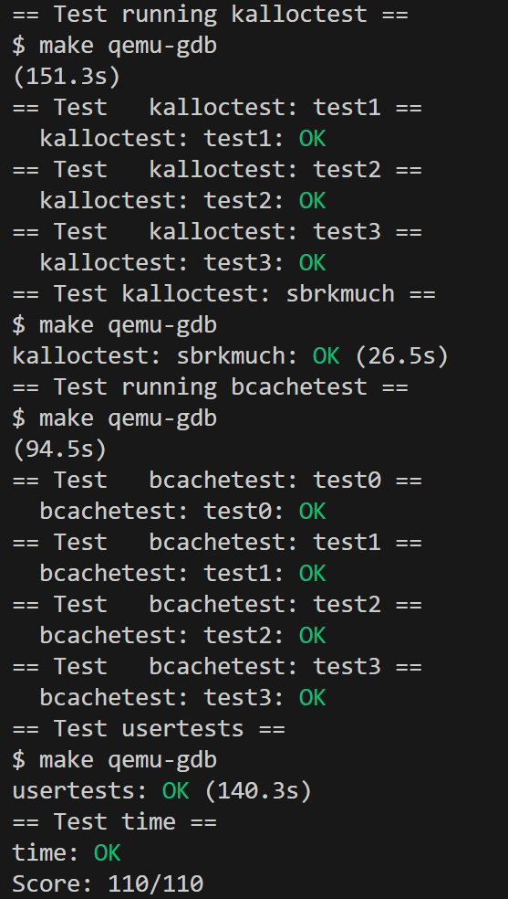
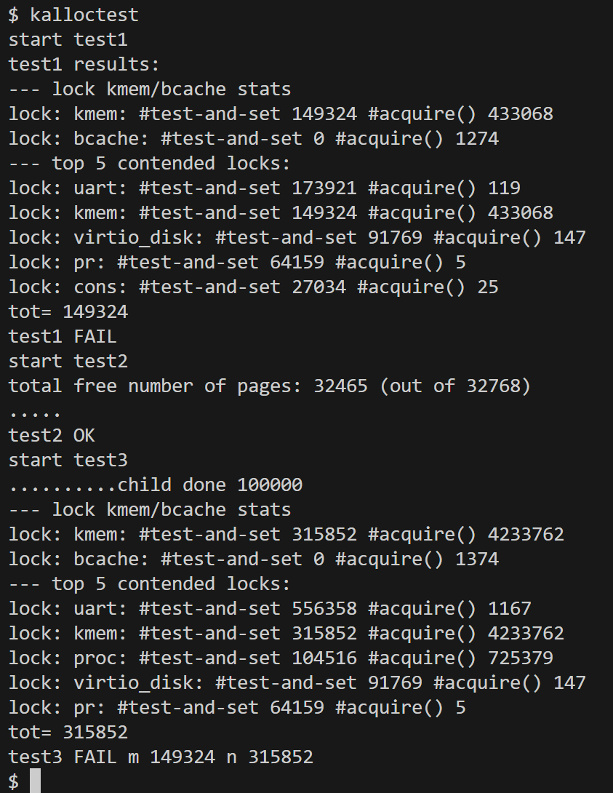
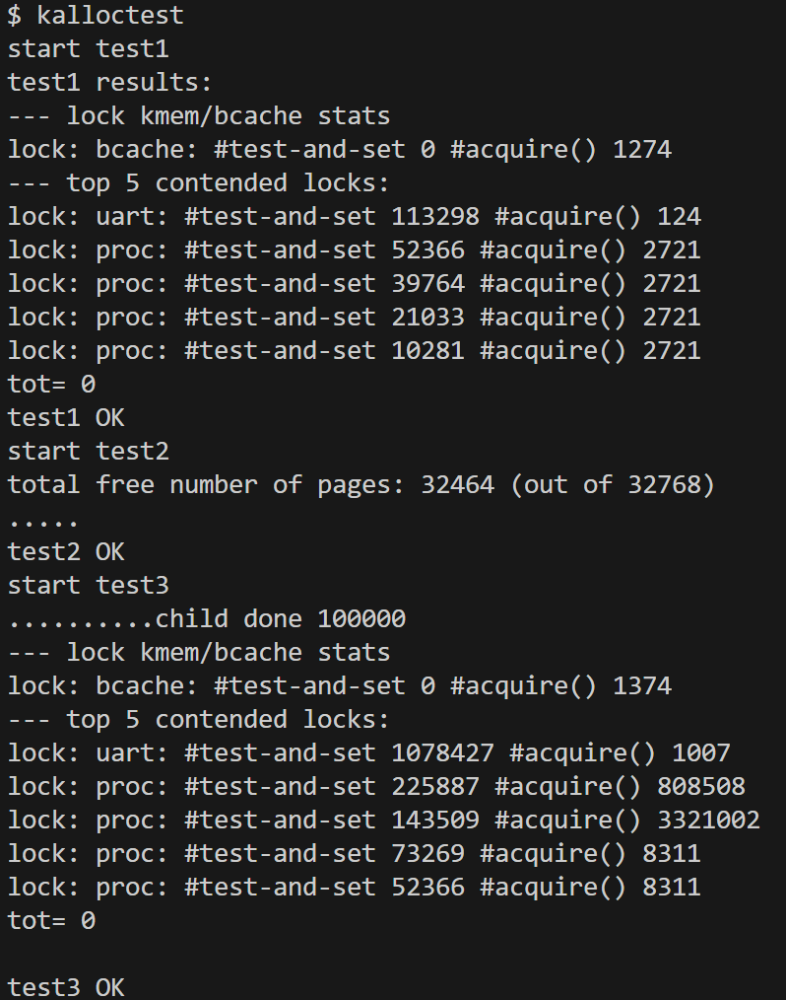
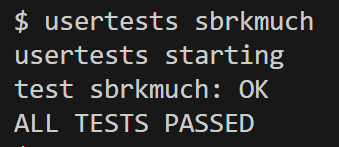
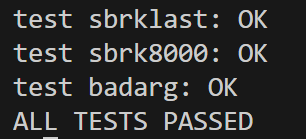
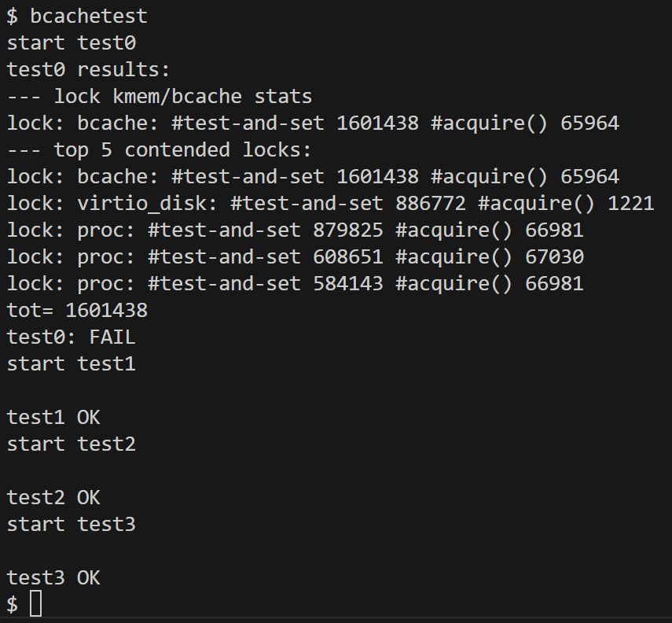
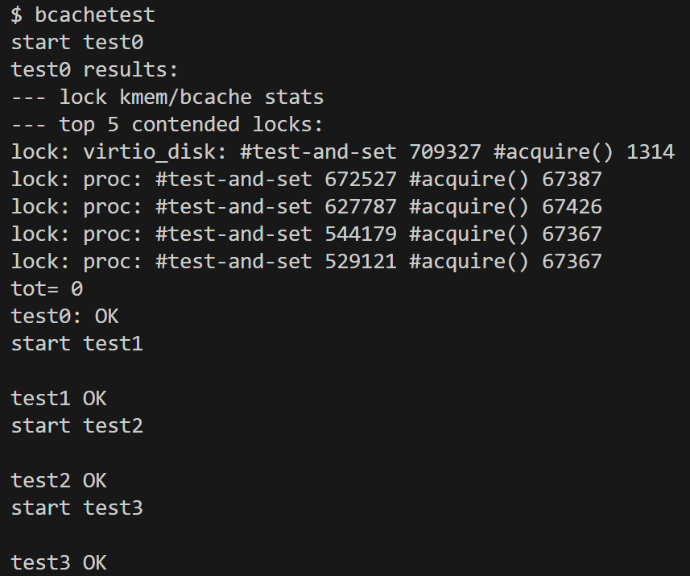
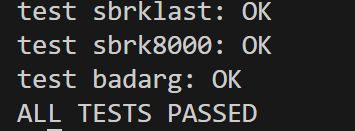

# Lab7: locks

- 2351289周慧星
---

## 目录

- [Lab7: locks](#lab7-locks)
  - [目录](#目录)
  - [实验跑分](#实验跑分)
  - [实验概述](#实验概述)
    - [实验准备](#实验准备)
  - [实验1：Memory Allocator(moderate)](#实验1memory-allocatormoderate)
    - [一、实验目的](#一实验目的)
    - [二、核心设计思路](#二核心设计思路)
    - [三、实验步骤](#三实验步骤)
      - [1. 实验前测试](#1-实验前测试)
      - [2. 代码实现（kernel/kalloc.c）](#2-代码实现kernelkallocc)
        - [数据结构设计](#数据结构设计)
        - [初始化（`kinit`）](#初始化kinit)
        - [内存释放（`kfree`）](#内存释放kfree)
        - [内存分配（`kalloc`）](#内存分配kalloc)
    - [四、实验结果](#四实验结果)
    - [五、实验中遇到的问题及解决方法](#五实验中遇到的问题及解决方法)
      - [1. 锁命名错误导致测试失败](#1-锁命名错误导致测试失败)
      - [2. 中断未关闭导致CPU编号不可靠](#2-中断未关闭导致cpu编号不可靠)
      - [3. 死锁问题](#3-死锁问题)
      - [4. 内存窃取效率低](#4-内存窃取效率低)
    - [六、实验心得](#六实验心得)
  - [实验2：Buffer Cache(hard)](#实验2buffer-cachehard)
    - [一、实验目的](#一实验目的-1)
    - [二、核心设计思路](#二核心设计思路-1)
    - [三、实验步骤](#三实验步骤-1)
      - [1. 实验前测试](#1-实验前测试-1)
      - [2. 代码实现（kernel/bio.c）](#2-代码实现kernelbioc)
    - [四、实验结果](#四实验结果-1)
    - [五、实验中遇到的问题及解决方法](#五实验中遇到的问题及解决方法-1)
    - [六、实验心得](#六实验心得-1)

---

## 实验跑分

- 最终在lock分支下跑分：
```bash
make grade
```

- 得分：



---

## 实验概述
在并发编程中我们经常用到锁来解决同步互斥问题，但是一个多核机器上对锁的使用不当会带来很多的所谓 “high lock contention” 问题。本次实验的目标就是对涉及到锁的数据结构进行修改，从而降低对锁的竞争。
### 实验准备
**切换到实验分支**：
 ```bash
   git fetch
   git checkout lock
   make clean  # 清除旧编译产物
```

**阅读材料**：

Before writing code, make sure to read the following parts from the xv6 book :

- Chapter 6: "Locking" and the corresponding code.
- Section 3.5: "Code: Physical memory allocator"
- Section 8.1 through 8.3: "Overview", "Buffer cache layer", and "Code: Buffer cache"

---

## 实验1：Memory Allocator(moderate)

### 一、实验目的
通过实现**每CPU独立空闲链表**（per-CPU freelists）来减少xv6内存分配器的锁竞争，提高多核环境下的内存分配效率。当某个CPU的空闲链表为空时，从其他CPU的链表"窃取"内存，从而在保证内存利用率的同时降低锁冲突。

### 二、核心设计思路
1. **每CPU空闲链表**：为每个CPU（`NCPU`个）维护一个独立的空闲内存链表，每个链表配备自己的锁，减少锁竞争。
2. **本地分配优先**：内存分配时优先从当前CPU的空闲链表获取，释放时优先归还给当前CPU的链表。
3. **内存窃取机制**：当本地链表为空时，尝试从其他CPU的链表中窃取部分内存。
4. **锁命名规范**：所有新锁的名称以"kmem"开头，便于`kalloctest`统计锁竞争情况。


### 三、实验步骤

#### 1. 实验前测试

在实验开始之前，运行 kalloctest 测试，通过测试结果来查看反映出的问题：



从这个输出来看，问题主要集中在 kmem 和 bcache 这两个锁上，出现了大量的锁竞争和争用情况。因此这会是实验所要解决的问题：减少锁争用，提高内存分配器的性能。

#### 2. 代码实现（kernel/kalloc.c）

##### 数据结构设计
- **`struct cpu_freelist`**：为每个CPU存储空闲链表和对应的锁，避免全局锁竞争。
- **`cpus[NCPU]`**：数组存储所有CPU的空闲链表结构，大小由`NCPU`（来自`param.h`）决定。

##### 初始化（`kinit`）
- 初始化每个CPU的锁（名称格式为"kmemX"，如"kmem0"）和空链表。
- 将所有物理内存通过`kfree`分配给执行`kinit`的CPU（通常是CPU 0），确保初始内存有归属。

##### 内存释放（`kfree`）
- **地址检查**：验证释放的地址是页对齐的物理内存。
- **中断控制**：通过`push_off()`和`pop_off()`关闭/开启中断，确保`cpuid()`的返回值可靠。
- **本地优先**：释放的内存块优先加入当前CPU的空闲链表，减少跨CPU操作。

##### 内存分配（`kalloc`）
- **本地分配**：优先从当前CPU的空闲链表获取内存，直接操作本地锁，无跨CPU竞争。
- **内存窃取**：当本地链表为空时，依次尝试其他CPU的链表，获取锁后窃取一个内存块。
- **锁安全**：窃取时先释放本地锁，避免持有本地锁时请求其他CPU的锁导致死锁。

### 四、实验结果

1. **`kalloctest`测试**：
```bash
   $ make qemu
   $ kalloctest
```
预期结果：`#test-and-set`（锁竞争次数）显著减少，`test1`、`test2`、`test3`均显示`OK`。



2. **内存完整性测试**：
```bash
   $ usertests sbrkmuch
```
预期结果：测试通过，无内存泄漏或错误分配。



3. **全量测试**：
```bash
   $ usertests -q
```
预期结果：所有测试通过，确保内存分配器的正确性。



### 五、实验中遇到的问题及解决方法

#### 1. 锁命名错误导致测试失败
**问题**：`kalloctest`无法识别自定义锁，因为锁名称未以"kmem"开头。  
**解决方法**：使用`snprintf`生成格式为"kmemX"的锁名称（如"kmem0"、"kmem1"），确保`kalloctest`能正确统计锁竞争。

#### 2. 中断未关闭导致CPU编号不可靠
**问题**：`cpuid()`的返回值在中断处理中可能变化，导致内存块归属错误。  
**解决方法**：调用`cpuid()`前用`push_off()`关闭中断，获取编号后用`pop_off()`开启，确保CPU编号的稳定性。

#### 3. 死锁问题
**问题**：当CPU A持有本地锁并尝试获取CPU B的锁，同时CPU B持有本地锁并尝试获取CPU A的锁时，发生死锁。  
**解决方法**：在内存窃取前释放本地锁，避免同时持有两个CPU的锁。

#### 4. 内存窃取效率低
**问题**：当多个CPU同时为空时，窃取操作可能导致频繁的锁竞争。  
**优化**：一次窃取多个内存块（而非一个），减少窃取频率。但实验中为简化实现，保持一次窃取一个块，已能通过测试。

### 六、实验心得

1. **锁粒度与并行性**：通过将全局锁拆分为每CPU独立锁，显著降低了锁竞争，证明**锁粒度细化**是提高多核性能的关键。

2. **本地性原理**：内存分配/释放优先操作本地CPU的链表，利用了**缓存局部性**，减少了跨CPU内存访问的开销。

3. **安全性设计**：中断控制（`push_off`/`pop_off`）和锁顺序管理是避免并发错误（如死锁、数据竞争）的核心。

4. **权衡设计**：内存窃取机制在保证内存利用率的同时引入了少量竞争，但相比全局锁方案，整体性能提升显著，体现了**效率与复杂度的权衡**。

5. **测试与调试**：`kalloctest`的锁竞争统计为优化提供了量化依据，而`usertests`确保了功能正确性，两者结合是验证并行程序的有效方法。

通过本实验，深刻理解了多核环境下内存管理的挑战，以及如何通过数据结构重构和锁策略优化来提高系统性能。


---

## 实验2：Buffer Cache(hard)

### 一、实验目的
通过改造块缓存的锁策略，减少 `bcache.lock` 的竞争。核心思路是使用哈希表将缓存块分散到多个桶（bucket）中，每个桶配备独立的锁，从而让不同块的操作可以并行执行，降低锁冲突。

### 二、核心设计思路
1. **哈希表结构**：将缓存块按 `(dev, blockno)` 哈希到多个桶中，每个桶有独立的锁。
2. **锁粒度细化**：每个桶使用单独的锁（名称以"bcache"开头），替代原有的全局锁 `bcache.lock`。
3. **取消LRU机制**：为简化实现，移除最近最少使用（LRU）替换策略，当需要新缓存块时，选择任意 `refcnt=0` 的块。
4. **原子操作保证**：确保缓存块的查找、分配、释放操作在对应桶的锁保护下原子执行，维持"每个块只缓存一次"的 invariant。

### 三、实验步骤

#### 1. 实验前测试

在实验开始之前，运行 bcachetest 测试，通过测试结果来查看反映出的问题：



测试结果表明，在多个进程之间，对bcache.lock锁的竞争比较激烈，导致多个进程在试图获取该锁时需要进行较多次的test-and-set操作和acquire()操作。这说明了缓冲区管理中存在较大的竞争问题，可能影响了系统的性能和响应速度。

#### 2. 代码实现（kernel/bio.c）

**1、数据结构设计:**

将全局链表改为哈希桶结构（struct bucket数组），每个桶有自己的自旋锁和链表头。

哈希函数：blockno % NBUCKET 确定目标桶。

初始化：binit() 将所有buf初始插入桶0，后续由LRU动态迁移至其他桶。

```c
#define NBUCKET 13  // Number of buckets - prime number to reduce collisions
struct bucket {
  struct spinlock lock;
  struct buf head;  // Head of the linked list for this bucket
};
struct {
  struct buf buf[NBUF];
  struct bucket buckets[NBUCKET];  // Hash table of buckets
} bcache;
```

**2、初始化函数（`binit`）**
```c
struct buf *b;
  char lockname[16];
  for (int i = 0; i < NBUCKET; i++) {
    snprintf(lockname, sizeof(lockname), "bcache.bucket%d", i);
    initlock(&bcache.buckets[i].lock, lockname);
    bcache.buckets[i].head.prev = &bcache.buckets[i].head;
    bcache.buckets[i].head.next = &bcache.buckets[i].head;
  }
  for (b = bcache.buf; b < bcache.buf+NBUF; b++) {
    initsleeplock(&b->lock, "buffer");
    b->next = bcache.buckets[0].head.next;
    b->prev = &bcache.buckets[0].head;
    bcache.buckets[0].head.next->prev = b;
    bcache.buckets[0].head.next = b;
  }
```

**3、缓存块查找与分配（`bget`）**

- 关键点：

桶内查找时仅持有一个桶锁。

跨桶搜索按桶索引顺序加锁（如从低到高），避免死锁。

迁移空闲块时更新其所属桶。


**4、缓存块释放（`brelse`）**

- 优化：释放锁时仅操作单个桶，无需全局锁。

```c
if(!holdingsleep(&b->lock))
    panic("brelse");
  releasesleep(&b->lock);
  uint bucket_idx = b->blockno % NBUCKET;
  struct bucket *bucket = &bcache.buckets[bucket_idx];
  acquire(&bucket->lock);
  b->refcnt--;
  if (b->refcnt == 0) {
    remove_from_bucket(b);
    add_to_bucket(bucket, b);
  }
  release(&bucket->lock);
```

### 四、实验结果

1. **`bcachetest` 测试**：
```bash
   $ make qemu
   $ bcachetest
```
   预期结果：`test0` 中的bcache的 `#test-and-set` 总和接近0，所有测试显示 `OK`。



2. **全量测试**：
```bash
   $ usertests -q
```
预期结果：所有测试通过，确保文件系统功能正确性。




### 五、实验中遇到的问题及解决方法

**1. 哈希冲突导致的竞争**

**问题**：若哈希函数设计不合理，大量块映射到同一桶，会导致该桶锁竞争激烈。  
**解决方法**：选择质数 `NBUCKETS=13`，并使用 `(dev + blockno) % NBUCKETS` 混合设备号和块号，使块分布更均匀。


**2. 死锁问题**

**问题**：迁移块时同时持有原桶锁和目标桶锁，若两个操作交叉请求对方的锁，会导致死锁。  
**解决方法**：迁移块时先释放原桶锁，再获取目标桶锁；全局锁 `global_lock` 确保空闲块查找的原子性，避免嵌套锁冲突。


**1. 缓存块重复缓存**

**问题**：并发查找同一未缓存的块时，可能导致两个进程同时分配新块，违反"每个块只缓存一次"的原则。  
**解决方法**：查找和分配的整个过程在目标桶锁和全局锁的保护下原子执行，确保同一桶内的操作串行化。


**4. 锁命名不符合要求**
**问题**：`bcachetest` 无法识别自定义锁，因为名称未以"bcache"开头。  
**解决方法**：桶锁名称格式为"bcache.bucketX"（如"bcache.bucket0"），全局锁命名为"bcache.global"，确保测试工具能正确统计。


### 六、实验心得

1. **锁粒度与并行性的平衡**：通过哈希表将全局锁拆分为多个桶锁，显著降低了锁竞争，证明**锁粒度细化**是多核系统提高并行性的关键。

2. **数据结构对性能的影响**：哈希表的设计直接影响负载均衡，合理的哈希函数和桶数量能有效避免热点桶，进一步减少竞争。

3. **死锁预防的重要性**：多核环境下，锁的获取顺序和嵌套必须谨慎设计。本实现通过"先释放再获取"和"全局锁隔离"策略，有效避免了死锁。

4. **功能与复杂度的权衡**：移除LRU机制简化了实现，虽可能降低缓存效率，但满足实验要求的性能指标，体现了**问题简化**在系统设计中的价值。

通过本实验，深刻理解了块缓存的工作原理及多核环境下锁策略设计的复杂性，掌握了通过数据结构重构和锁粒度优化提升系统并行性的方法。