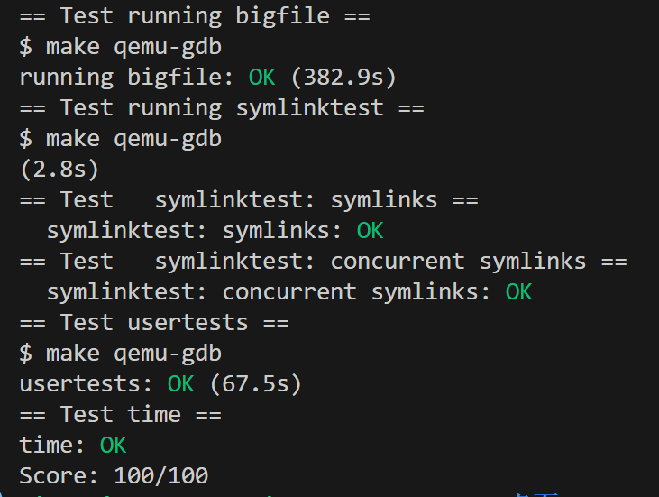
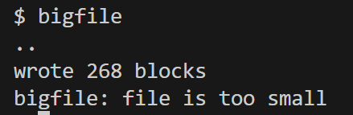
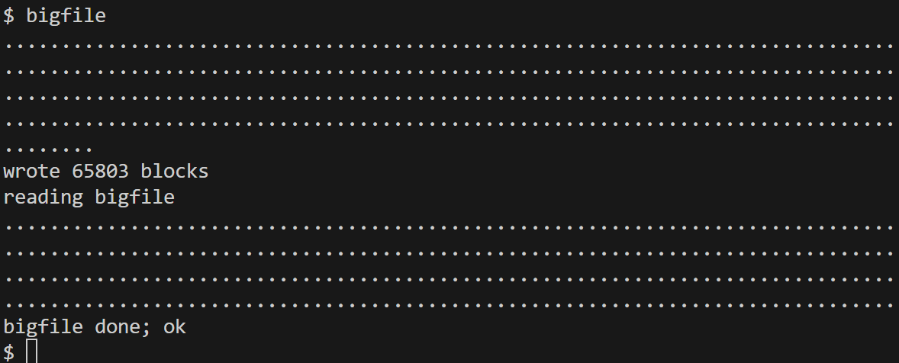
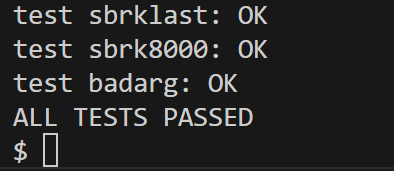
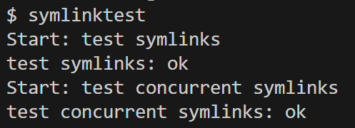
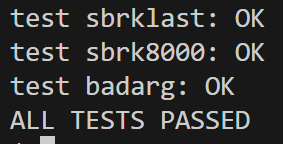

# Lab8: file system

- 2351289周慧星
---

## 目录

- [Lab8: file system](#lab8-file-system)
  - [目录](#目录)
  - [实验跑分](#实验跑分)
  - [实验概述](#实验概述)
    - [实验准备](#实验准备)
  - [实验1：Large files (moderate)](#实验1large-files-moderate)
    - [**一、实验目的**](#一实验目的)
    - [**二、实验步骤**](#二实验步骤)
    - [**三、实验结果**](#三实验结果)
    - [**四、实验遇到的问题及解决方法**](#四实验遇到的问题及解决方法)
    - [**五、实验心得**](#五实验心得)
  - [实验2：Symbolic links (moderate)](#实验2symbolic-links-moderate)
    - [**一、实验目的**](#一实验目的-1)
    - [**二、实验步骤**](#二实验步骤-1)
    - [**三、实验结果**](#三实验结果-1)
    - [**四、实验遇到的问题及解决方法**](#四实验遇到的问题及解决方法-1)
    - [**五、实验心得**](#五实验心得-1)


---

## 实验跑分

- 最终在fs分支下跑分：
```bash
make grade
```

- 得分：



---

## 实验概述
在本实验中，将为 xv6 文件系统添加大文件和符号链接。
### 实验准备
**切换到实验分支**：
 ```bash
   git fetch
   git checkout fs
   make clean  # 清除旧编译产物
```

**阅读材料**：

Before writing code, you should read "Chapter 8: File system" from the xv6 book and study the corresponding code.

---

## 实验1：Large files (moderate)

### **一、实验目的**

扩展 XV6 文件系统的文件大小限制，从原来的 268 块（268KB）提升到 65,803 块（约 65MB）。通过实现`双重间接块（double-indirect block）`机制，解决原文件系统只能使用 12 个直接块和 1 个单间接块的限制。

---

### **二、实验步骤**

1. **实验前测试**

在实验开始之前，运行 `bigfile` 测试：



可以看到，原系统只能处理最大 268 块的文件，无法满足大文件需求。

2. **修改 inode 结构（`fs.h`）**  
- 将直接块数量从 12 减少到 11，为双重间接块腾出空间：
```c
     #define NDIRECT 11
     #define NDINDIRECT (NINDIRECT * NINDIRECT) // 256 * 256 = 65,536
     #define MAXFILE (NDIRECT + NINDIRECT + NDINDIRECT)
```
- 调整 `fs.h`的`struct dinode` 和 `file.h`的`struct inode` 中的 `addrs` 数组大小：
```c
     uint addrs[NDIRECT + 2]; // 11 直接块 + 1 单间接块 + 1 双间接块
```

3. **实现双重间接块映射（`fs.c/bmap`）**  
- 添加双重间接块处理逻辑：
```c
  bn -= NINDIRECT;
  // 双重间接块处理
  if(bn < NDINDIRECT) {
    // 第一级间接块
    if((addr = ip->addrs[NDIRECT+1]) == 0)
      ip->addrs[NDIRECT+1] = addr = balloc(ip->dev);
    bp = bread(ip->dev, addr);
    a = (uint*)bp->data;
    // 第二级间接块
    if((addr = a[bn/NINDIRECT]) == 0) {
      a[bn/NINDIRECT] = addr = balloc(ip->dev);
      log_write(bp);
    }
    brelse(bp);
    // 数据块
    bp = bread(ip->dev, addr);
    a = (uint*)bp->data;
    if((addr = a[bn%NINDIRECT]) == 0) {
      a[bn%NINDIRECT] = addr = balloc(ip->dev);
      log_write(bp);
    }
    brelse(bp);
    return addr;
  }
```

4. **修改文件截断函数（`fs.c/itrunc`）**  
- 添加双重间接块释放逻辑：
```c
if(ip->addrs[NDIRECT+1]) {
    bp = bread(ip->dev, ip->addrs[NDIRECT+1]);
    a = (uint*)bp->data;
    
    for(int i = 0; i < NINDIRECT; i++) {
      if(a[i]) {
        // 释放第二级间接块指向的所有数据块
        struct buf *bp2 = bread(ip->dev, a[i]);
        uint *a2 = (uint*)bp2->data;
        for(int j = 0; j < NINDIRECT; j++) {
          if(a2[j])
            bfree(ip->dev, a2[j]);
        }
        brelse(bp2);
        bfree(ip->dev, a[i]); // 释放第二级间接块
      }
    }
    brelse(bp);
    bfree(ip->dev, ip->addrs[NDIRECT+1]); // 释放双重间接块
    ip->addrs[NDIRECT+1] = 0;
  }
```

---

### **三、实验结果**
1. **大文件测试**：
```sh
$ bigfile
```

结果显示成功创建了一个65803个块的大文件，验证了双重间接块的正确实现：



2. **文件系统完整性测试**：
```sh
$ usertests -q
```

结果显示所有测试通过，确保文件系统功能正常：



---

### **四、实验遇到的问题及解决方法**
1. **块计算错误**  
   - **问题**：初始实现中双重间接块的偏移计算错误，导致文件末尾数据损坏。
   - **解决**：仔细验证 `bn` 的计算公式 `bn -=NINDIRECT`，确保正确跳过直接块和单间接块区域。

2. **内存泄漏**  
   - **问题**：在 `bmap()` 中未及时 `brelse()` 中间缓冲区，导致缓冲区缓存耗尽。
   - **解决**：为每个 `bread()` 添加配对的 `brelse()`，确保每次分配后释放缓冲区。

3. **文件系统崩溃**  
   - **问题**：测试失败后 `fs.img` 损坏。
   - **解决**：删除损坏的 `fs.img` 并运行 `make clean` 重新生成干净的磁盘镜像。

---

### **五、实验心得**

通过修改 inode 和块分配逻辑，清晰理解了文件系统中直接块、单间接块和双间接块的三级存储结构。

学习到文件系统必须精确管理磁盘块的分配和释放，避免内存泄漏和资源耗尽。

使用 `printf` 跟踪块分配过程，帮助定位复杂的逻辑错误。


---

## 实验2：Symbolic links (moderate)

### **一、实验目的**
在 XV6 文件系统中实现符号链接（软链接）功能，支持创建指向文件或目录的路径引用。解决原系统只支持硬链接的限制，实现跨文件系统的链接能力。

---

### **二、实验步骤**
1. **新增系统调用和类型定义等等**  
- 在 `syscall.h` 添加系统调用号：
```c
     #define SYS_symlink 22
```
- 在 `usys.pl` 添加用户态入口：
```perl
     entry("symlink");
```
- 在`user.h`中添加：
```c
     int symlink(const char *target, const char *path);
```
- 在 `stat.h` 定义符号链接类型：
```c
     #define T_SYMLINK 4
```
- 在 `syscall.c` 中添加：
```c
     extern uint64 sys_symlink(void);
    [SYS_symlink] sys_symlink,
```
- 在 `fcntl.h` 中添加`O_NOFOLLOW` 标志：
```c
    #define O_NOFOLLOW 0x004
```
- 在 `makefile` 中添加 `symlinktest`来创建测试程序：
```makefile
    UPROGS=\
        $U/_symlinktest\
```

2. **实现 `symlink` 系统调用（`sysfile.c`）**  
```c
uint64
sys_symlink(void)
{
  char target[MAXPATH], path[MAXPATH];
  struct inode *ip;
  if(argstr(0, target, MAXPATH) < 0 || argstr(1, path, MAXPATH) < 0)
    return -1;
  begin_op();
  ip = create(path, T_SYMLINK, 0, 0);
  if(ip == 0){
    end_op();
    return -1;
  }
  if(writei(ip, 0, (uint64)target, 0, MAXPATH) < MAXPATH) {
    iunlockput(ip);
    end_op();
    return -1;
  }
  iunlockput(ip);
  end_op();
  return 0;
}
```

3. **修改 `open` 支持链接解析（`sysfile.c`）**  
```c
    char target[MAXPATH];  // 用于存储符号链接的目标路径
    if(ip->type == T_SYMLINK && !(omode & O_NOFOLLOW)) {
      for(int i = 0; i < 10; i++) {
        if(readi(ip, 0, (uint64)target, 0, MAXPATH) != MAXPATH) {
          iunlockput(ip);
          end_op();
          return -1;
        }
        iunlockput(ip);
        ip = namei(target);
        if(ip == 0) {
          end_op();
          return -1;
        }
        ilock(ip);
        if(ip->type != T_SYMLINK) {
          break;
        }
      }
      if(ip->type == T_SYMLINK) {
        iunlockput(ip);
        end_op();
        return -1;
      }
    }
```

---

### **三、实验结果**
1. **符号链接功能测试**：
```sh
   $ symlinktest
```




2. **完整系统测试**：
```sh
   $ usertests -q
```



---

### **四、实验遇到的问题及解决方法**
1. **链接解析死循环**  
   - **问题**：初始实现未限制解析深度，导致循环链接时系统卡死。
   - **解决**：添加最大解析深度限制（10 层），超过时返回错误。

2. **路径缓冲区溢出**  
   - **问题**：`readi()` 读取路径时未检查边界，可能溢出缓冲区。
   - **解决**：使用 `MAXPATH` 限制读写长度，确保路径不超过 512 字节。

3. **并发访问问题**  
   - **问题**：多进程同时解析符号链接时可能引发竞争条件。
   - **解决**：通过 `ilock()` 和 `iunlock()` 确保 inode 操作的原子性。

---

### **五、实验心得**
1. **文件系统扩展性**：学习到如何通过新增系统调用扩展文件系统功能，同时保持向后兼容。
2. **安全设计意识**：实现中必须考虑边界条件（如路径长度、解析深度）和错误处理。
3. **链接机制理解**：通过实现符号链接，深入理解了软链接与硬链接在实现和功能上的关键区别。
4. **跨组件协作**：符号链接功能涉及系统调用、文件操作和路径解析等多个模块的协作，加深了对系统整体架构的理解。