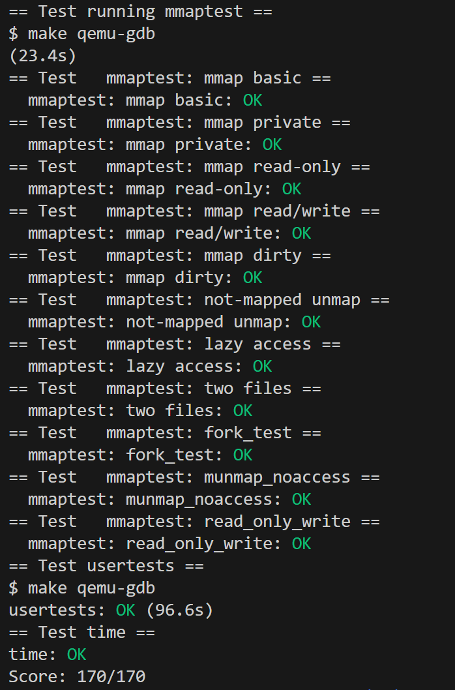
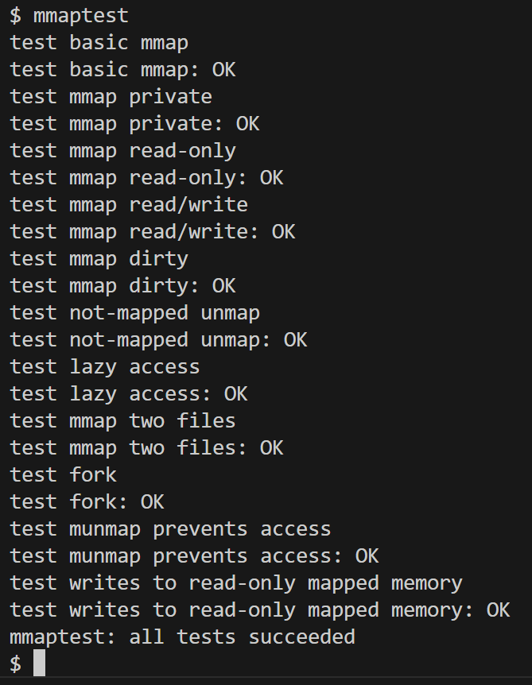
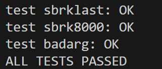

# Lab9: mmap(hard)

- 2351289周慧星
---

## 目录


- [Lab9: mmap(hard)](#lab9-mmaphard)
  - [目录](#目录)
  - [实验跑分](#实验跑分)
  - [一、实验目的](#一实验目的)
  - [二、实验步骤](#二实验步骤)
    - [1、切换到实验分支：](#1切换到实验分支)
    - [2、数据结构定义](#2数据结构定义)
    - [3、系统调用声明](#3系统调用声明)
    - [4、mmap 系统调用实现](#4mmap-系统调用实现)
    - [5、页面错误处理](#5页面错误处理)
    - [6、munmap 系统调用实现](#6munmap-系统调用实现)
    - [7、修改 exit 和 fork](#7修改-exit-和-fork)
  - [三、实验结果](#三实验结果)
  - [四、实验遇到的问题及解决方法](#四实验遇到的问题及解决方法)
  - [五、实验心得](#五实验心得)


---

## 实验跑分

- 最终在mmp分支下跑分：
```bash
make grade
```

- 得分：



---

## 一、实验目的
本次实验旨在向 xv6 操作系统实现 `mmap` 和 `munmap` 系统调用，实现对进程地址空间的详细控制。通过实现这两个系统调用，我们可以实现内存映射文件的功能，包括共享内存、将文件映射到进程地址空间等。这有助于理解虚拟内存管理和页面错误处理的机制。


## 二、实验步骤

### 1、切换到实验分支：
 ```bash
   git fetch
   git checkout mmp
   make clean  # 清除旧编译产物
 ```
 
### 2、数据结构定义

首先在 `kernel/proc.h` 中添加 VMA 结构定义：

```c
#define NVMA 16
struct vma {
  int used;                   // 是否使用
  uint64 addr;                // 起始虚拟地址
  uint64 len;                 // 长度
  int prot;                   // 保护权限
  int flags;                  // MAP_SHARED 或 MAP_PRIVATE
  struct file *file;          // 映射的文件
  uint64 offset;              // 文件偏移
};
```

在进程结构体 `struct proc` 中添加 VMA 数组：

```c
struct vma vmas[NVMA];        // 虚拟内存区域数组
```

### 3、系统调用声明

在 `user/user.h` 中添加系统调用声明：

```c
void *mmap(void *addr, size_t length, int prot, int flags, int fd, off_t offset);
int munmap(void *addr, size_t length);
```

在 `kernel/syscall.h` 中添加系统调用号：

```c
#define SYS_mmap   22
#define SYS_munmap 23
```

### 4、mmap 系统调用实现

`kernel/sysfile.c` 中的实现：

```c
uint64
sys_mmap(void)
{
  uint64 addr;
  uint64 len;
  int prot;
  int flags;
  int fd;
  uint64 offset;
  if(argaddr(0, &addr) < 0 || argaddr(1, &len) < 0 || argint(2, &prot) < 0 ||
     argint(3, &flags) < 0 || argint(4, &fd) < 0 || argaddr(5, &offset) < 0)
    return -1;
  if(addr != 0)
    return -1;
  if(prot & ~(PROT_READ|PROT_WRITE|PROT_EXEC))
    return -1;
  struct proc *p = myproc();
  struct file *f = p->ofile[fd];
  if(f == 0)
    return -1;
  struct vma *v = 0;
  for(int i = 0; i < NVMA; i++) {
    if(p->vmas[i].used == 0) {
      v = &p->vmas[i];
      break;
    }
  }
  if(v == 0)
    return -1;
  uint64 va = p->sz;
  if(va + len > MAXVA)
    return -1;
  v->used = 1;
  v->addr = va;
  v->len = len;
  v->prot = prot;
  v->flags = flags;
  v->file = filedup(f);  // 增加文件引用计数
  v->offset = offset;
  p->sz = va + len;
  return va;
}
```

### 5、页面错误处理

在 `kernel/trap.c` 的 `usertrap` 函数中添加：

```c
else if(r_scause() == 13 || r_scause() == 15) {
  uint64 va = r_stval();
  if(va >= p->sz || va < p->trapframe->sp)
    goto bad;
  struct vma *vma = 0;
  for(int i = 0; i < NVMA; i++) {
    if(p->vmas[i].used && va >= p->vmas[i].addr && va < p->vmas[i].addr + p->vmas[i].len) {
      vma = &p->vmas[i];
      break;
    }
  }
  if(vma == 0)
    goto bad;
  char *mem = kalloc();
  if(mem == 0)
    goto bad;
  memset(mem, 0, PGSIZE);
  ilock(vma->file->ip);
  uint64 offset = vma->offset + PGROUNDDOWN(va - vma->addr);
  readi(vma->file->ip, 0, (uint64)mem, offset, PGSIZE);
  iunlock(vma->file->ip);
  int perm = PTE_U;
  if(vma->prot & PROT_READ)
    perm |= PTE_R;
  if(vma->prot & PROT_WRITE)
    perm |= PTE_W;
  if(vma->prot & PROT_EXEC)
    perm |= PTE_X;
  if(mappages(p->pagetable, PGROUNDDOWN(va), PGSIZE, (uint64)mem, perm) != 0) {
    kfree(mem);
    goto bad;
  }
}
```

### 6、munmap 系统调用实现

```c
uint64
sys_munmap(void)
{
  uint64 addr;
  uint64 len;
  
  if(argaddr(0, &addr) < 0 || argaddr(1, &len) < 0)
    return -1;
  struct proc *p = myproc();
  struct vma *vma = 0;
  int i;
  for(i = 0; i < NVMA; i++) {
    if(p->vmas[i].used && addr >= p->vmas[i].addr && addr < p->vmas[i].addr + p->vmas[i].len) {
      vma = &p->vmas[i];
      break;
    }
  }
  if(vma == 0)
    return -1;
  if(addr != vma->addr && addr + len != vma->addr + vma->len)
    return -1;
  if((vma->flags & MAP_SHARED) && (vma->prot & PROT_WRITE)) {
    filewrite(vma->file, addr, len);
  }
  uvmunmap(p->pagetable, addr, len / PGSIZE, 1);
  if(addr == vma->addr) {
    vma->addr += len;
    vma->len -= len;
  } else {
    vma->len -= len;
  }
  if(vma->len == 0) {
    fileclose(vma->file);
    vma->used = 0;
  }
  return 0;
}
```

### 7、修改 exit 和 fork

在 `kernel/proc.c` 中修改 `exit` 函数：

```c
for(int i = 0; i < NVMA; i++) {
  if(p->vmas[i].used) {
    if((p->vmas[i].flags & MAP_SHARED) && (p->vmas[i].prot & PROT_WRITE)) {
      filewrite(p->vmas[i].file, p->vmas[i].addr, p->vmas[i].len);
    }
    uvmunmap(p->pagetable, p->vmas[i].addr, p->vmas[i].len / PGSIZE, 1);
    fileclose(p->vmas[i].file);
    p->vmas[i].used = 0;
  }
}
```

修改 `fork` 函数：

```c
for(int i = 0; i < NVMA; i++) {
  if(p->vmas[i].used) {
    np->vmas[i] = p->vmas[i];
    filedup(np->vmas[i].file);  // 增加文件引用计数
  }
}
```

## 三、实验结果

运行测试程序：

```bash
$ mmaptest
```



```bash
$ usertests -q
```




## 四、实验遇到的问题及解决方法

一开始编译时就遇到了结构体定义不完整的报错，提示"incomplete type"。仔细检查后发现是因为struct vma在使用前没有完整定义，而且相关的file结构体也没有正确定义。我重新组织了头文件包含顺序，在proc.h中完整定义了struct vma的所有字段，包括used标志、地址范围、保护权限等，同时确保file.h中正确定义了file和inode结构体。这个过程中还发现spinlock.h和sleeplock.h之间存在循环依赖，通过调整头文件包含顺序解决了这个问题。

接着遇到了常量未定义的错误，比如MAP_SHARED和PTE_D找不到。查阅RISC-V手册后，我在riscv.h中补充了PTE_D的定义，表示脏页标志位。在proc.h中定义了MAP_SHARED和MAP_PRIVATE等内存映射标志，保持与用户态定义一致。

实现功能时遇到最麻烦的问题是懒加载机制。最初的想法是在mmap调用时就加载所有文件内容，但测试大文件时性能很差。改为在usertrap中处理缺页异常时才加载对应文件块，这样不仅性能提升，还能支持超过物理内存大小的文件映射。这里需要特别注意文件偏移量的计算，我花了很长时间调试一个off-by-one错误。

fork函数中对mmap区域的复制也遇到问题。开始时简单复制了vma结构体，但忘记增加文件引用计数，导致文件被提前关闭。后来在复制每个vma时都调用filedup增加引用计数，确保文件资源正确管理。

exit函数的实现中，最初没有处理MAP_SHARED区域的写回操作，导致修改无法保存。后来添加了遍历页表检查脏页的逻辑，将修改过的页面写回文件。这里还遇到文件系统操作必须放在begin_op和end_op之间的约束，调试了很久才找到这个坑。

测试过程中发现munmap部分取消映射时，剩余区域的地址计算有误。通过画图分析虚拟地址空间布局，最终修正了addr和len的调整逻辑。此外还发现页表项权限设置不正确，导致只读映射被意外修改，补充了prot标志的严格检查。

## 五、实验心得

通过这次mmap实验，我对操作系统内存管理和文件系统的理解达到了新的深度。刚开始面对实验要求时，感觉无从下手，但随着代码一行行实现，整个设计思路逐渐清晰起来。

最让我印象深刻的是懒加载机制的实现过程。最初我试图在mmap调用时就加载整个文件内容，结果发现处理大文件时性能极差，系统响应缓慢。改为缺页中断时按需加载后，不仅性能显著提升，还意外地获得了处理超大文件的能力。这种设计上的转变让我真正理解了"懒加载"的精妙之处——推迟工作直到真正需要时才执行，这种思想在系统设计中随处可见。

在实现fork函数时，我犯过一个典型的资源管理错误：复制vma结构后忘记增加文件引用计数。这导致父进程退出时文件被提前关闭，子进程访问映射区域时出现异常。通过gdb逐步跟踪，最终锁定了问题根源。这次调试经历让我深刻认识到，在系统编程中，资源生命周期的管理容不得半点马虎。

实验中最有挑战性的部分是处理munmap的部分取消映射。起初我简单地认为只需要调整地址范围即可，结果导致后续的内存访问出现各种异常。通过在白板上反复绘制地址空间布局图，我终于理解了需要区分从头部取消映射和从尾部取消映射两种不同情况，并正确计算剩余区域的起始地址和长度。这个过程教会我，复杂的内存操作必须辅以图形化的思考方式。

exit函数的实现也给我上了宝贵的一课。最初版本忽略了MAP_SHARED区域的写回操作，直到测试用例失败才发现问题。添加脏页检查逻辑时，又遇到了文件系统事务处理的约束条件。这些曲折让我明白，系统各组件间的交互协议必须严格遵守，任何疏漏都会导致难以预料的后果。

通过这次实验，我不但掌握了mmap/munmap的核心原理，更重要的是培养了系统编程的思维方式：注重资源管理、理解底层机制、严谨处理边界条件。当最终看到所有测试用例通过时，那种攻克难题的成就感令人难忘。这些经验对我后续学习操作系统其他模块奠定了坚实基础。