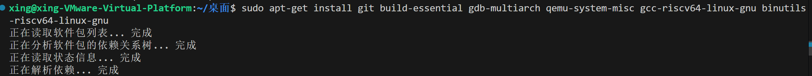

# 环境搭建和Tools

使用VMware、Ubuntu和VS Code完成xv6实验并搭建环境，可按照以下步骤操作，结合文档中6.1810课程所需工具的安装要求进行配置：

---

## 目录

- [环境搭建和Tools](#环境搭建和tools)
  - [目录](#目录)
  - [一、通过VMware安装Ubuntu系统](#一通过vmware安装ubuntu系统)
  - [二、本地 VS Code 连接 Ubuntu 虚拟机](#二本地-vs-code-连接-ubuntu-虚拟机)
    - [1、配置 Ubuntu 虚拟机的 SSH 服务（允许远程连接）](#1配置-ubuntu-虚拟机的-ssh-服务允许远程连接)
    - [2、本地 VS Code 安装远程连接插件](#2本地-vs-code-安装远程连接插件)
    - [3、本地 VS Code 连接 Ubuntu 虚拟机](#3本地-vs-code-连接-ubuntu-虚拟机)
  - [三、在Ubuntu中安装实验所需工具](#三在ubuntu中安装实验所需工具)
  - [四、验证环境](#四验证环境)

---

## 一、通过VMware安装Ubuntu系统

[在VMware中安装Ubuntu系统](https://blog.csdn.net/m0_68165821/article/details/137742592?ops_request_misc=%257B%2522request%255Fid%2522%253A%2522b9966637ebf31002532785a99d45c28a%2522%252C%2522scm%2522%253A%252220140713.130102334..%2522%257D&request_id=b9966637ebf31002532785a99d45c28a&biz_id=0&utm_medium=distribute.pc_search_result.none-task-blog-2~all~sobaiduend~default-1-137742592-null-null.142^v102^pc_search_result_base4&utm_term=vwmare安装ubuntu&spm=1018.2226.3001.4449)，作为xv6实验的开发环境。以下是详细步骤：
1. **准备工作**  
   - 下载并安装VMware Workstation Pro（或Player），确保软件正常运行。  
   - 下载Ubuntu 24.04（或更高版本）的ISO镜像文件（推荐Ubuntu 24及以上以保证QEMU版本兼容性）。  

2. **创建Ubuntu虚拟机**  
   - 打开VMware，点击“创建新的虚拟机”，选择“典型”配置。  
   - 选择下载好的Ubuntu ISO镜像，按照向导设置虚拟机名称、存储路径、磁盘大小（建议至少20GB）。  
   - 启动虚拟机，按照Ubuntu安装向导完成系统安装（设置用户名、密码等）。 
 


---

## 二、本地 VS Code 连接 Ubuntu 虚拟机

在本地 VS Code 中连接 Ubuntu 虚拟机，进行 xv6 实验开发。

### 1、配置 Ubuntu 虚拟机的 SSH 服务（允许远程连接）

1. **安装 SSH 服务器**  
    在 Ubuntu 虚拟机终端执行：
    ```bash
    sudo apt-get install openssh-server
    ```

2. **启动 SSH 服务并设置开机自启**  
    ```bash
    sudo systemctl start ssh
    sudo systemctl enable ssh
    ```

3. **获取虚拟机的 IP 地址**  
    执行以下命令查看 Ubuntu 的 IP（用于本地连接）：
    ```bash
    ip addr
    ```


---

### 2、本地 VS Code 安装远程连接插件

1. 打开本地（Windows/macOS）的 VS Code，在扩展商店搜索并安装：
    - **Remote - SSH**：允许通过 SSH 连接远程服务器（此处即 Ubuntu 虚拟机）。
    - **C/C++**：支持 C 语言语法高亮、调试（远程环境也适用）。

---

### 3、本地 VS Code 连接 Ubuntu 虚拟机

1. 点击 VS Code 左侧的 “远程资源管理器” 图标，或按 `Ctrl+Shift+P` 打开命令面板，输入 `Remote-SSH: Connect to Host...`。
2. 选择 “Add New SSH Host...”，输入 SSH 连接命令：
    ```bash
    ssh 用户名@虚拟机IP地址  # 例如我的：ssh xing@192.168.24.128
    ```
3. 选择保存 SSH 配置文件的路径（默认即可），然后点击连接。
4. 首次连接需验证虚拟机密码，输入 Ubuntu 的登录密码后，即可成功远程连接。

---

## 三、在Ubuntu中安装实验所需工具
需安装RISC-V版本的QEMU、GDB、GCC和Binutils等工具，步骤如下：  
1. **更新系统包**  
   打开Ubuntu终端，执行以下命令更新软件源：  
   ```bash
   sudo apt-get update && sudo apt-get upgrade
   ```  


2. **安装核心工具**  
   运行针对Ubuntu的安装命令：  
   ```bash
   sudo apt-get install git build-essential gdb-multiarch qemu-system-misc gcc-riscv64-linux-gnu binutils-riscv64-linux-gnu
   ```  
   这些工具包括：  
   - `qemu-system-misc`：RISC-V架构的QEMU模拟器（需版本7.2+）。  
   - `gcc-riscv64-linux-gnu`：RISC-V交叉编译器。  
   - `gdb-multiarch`：支持多架构的GDB调试器。  



---

## 四、验证环境
完成工具安装后，需验证环境是否搭建成功：
1. **验证工具安装正确性**  
检查工具版本：  
   - 检查QEMU版本（需7.2+）：  
```bash
     qemu-system-riscv64 --version
```  


   - 检查RISC-V GCC版本（至少一个可用）：  
```bash
     riscv64-linux-gnu-gcc --version
```  
